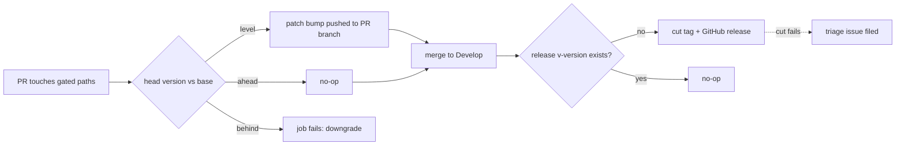

## Summary

Give NEAT-AI-Rebase the family version gate and a tag-on-bump release, so
NEAT-AI-Forests can pin `neat-ai-rebase` to a release instead of a commit SHA.
Closes #106.

* `scripts/auto-version.sh` — copied **byte-identical** from NEAT-AI-Ockham
  (verified with `diff` against `stSoftwareAU/NEAT-AI-Ockham` `Develop`).
* `.github/workflows/version-increment.yml` — on a PR into `Develop` or
  `milestone/**` touching `rebase/src/**`, `rebase/Cargo.toml`, `Cargo.lock`,
  the bump script or the workflow itself: patch-bump when the version is level
  with the base branch, no-op when already ahead, fail the job on a downgrade.
* `.github/workflows/release.yml` — on a push to `Develop` touching
  `rebase/Cargo.toml`: cut `v<version>` and a GitHub release when absent,
  no-op when already released, and file a triage issue when the cut fails.
* `rebase/Cargo.toml` 0.1.0 → 0.1.1 (and `Cargo.lock`), so merging this PR cuts
  the repository's first release, `v0.1.1`.
* README and CONTRIBUTING document both halves.



## Evidence

Backend/CI change — no web interface to screenshot. The evidence is the test
suite and the local gate, which mirror what CI runs:

* `./quality.sh` — **All quality checks passed!** (bash syntax, shellcheck,
  `runlib.sh` contract, actionlint on both new workflows, neat-core version
  gate, `cargo deny check`, `cargo fmt --check`, clippy `-D warnings`,
  `cargo test --workspace --all-features`, `cargo doc -D warnings`).
* `markdownlint-cli2` — 0 issues across the 8 linted Markdown files.
* `scripts/auto-version.sh` drives the acceptance behaviour directly:

  ```text
  $ ./scripts/auto-version.sh rebase/Cargo.toml 0.1.0 Cargo.lock
  auto-version.sh: bumped neat-ai-rebase 0.1.0 -> 0.1.1
  ```

Two behaviours cannot be exercised before the merge, and are stated as such:
the bump commit CI pushes onto a PR branch, and the tag/release cut on the push
to `Develop`. Both are covered by the trigger/path tests plus the script tests
below.

### Known caveats, recorded rather than hidden

* With `ACTIONS_PUSH` unset, a commit pushed with the default `GITHUB_TOKEN`
  starts no workflow run, so the bump commit becomes the PR head with no run of
  its own — the caveat `cargo-upgrade.yml` already documents for this repo. The
  bump changes two version strings and nothing else, and the next push to the
  PR gates it. Noted in the workflow.
* `version-increment.yml` filters `milestone/**` (the pattern the issue's model,
  NEAT-AI-Lamarck, uses) while `ci.yml` filters `milestone/*`. `**` is the
  broader of the two, so a nested slug is bumped but not quality-gated;
  widening `ci.yml` is out of scope here.

## Acceptance Criteria

<!-- vibe-spec-review inputs="diff+issue-body" -->

- **met** — a PR changing `rebase/src/**` at an unchanged version receives a patch-bump commit from CI; a PR whose version is below Develop fails CI — evidence: `.github/workflows/version-increment.yml` (paths, base read, `auto-version.sh <manifest> <base> Cargo.lock`, commit/push) with `rebase/tests/auto_version.rs::bumps_the_patch_when_the_pr_has_not_bumped_it` and `::rejects_a_downgrade_against_the_base_branch` — reviewer: met
- **partial** — merging a bump to Develop produces tag `v<version>` and a release; re-running the job is a no-op — evidence: `.github/workflows/release.yml` gate + create steps, `rebase/tests/version_release_workflows.rs::release_cuts_tags_on_pushes_to_develop` and `::release_fires_only_on_a_manifest_change` — reviewer: partial — reason: the repo still has zero tags; the first release (`v0.1.1`, from the bump in this PR) can only be cut by the post-merge push, so the trigger, the path and the idempotent gate are all that can be verified pre-merge
- **met** — tests and quality checks pass — evidence: `./quality.sh` green after the final edit; the Spec reviewer independently ran shellcheck, actionlint, fmt, clippy, the full test suite and markdownlint — reviewer: met
- **met** — failure detection: the trigger test fails CI on a misconfigured trigger or path list, and the release job exits non-zero when the tag cannot be created — evidence: `trigger_block`/`trigger_list` in `rebase/tests/version_release_workflows.rs` panic on an absent trigger or key rather than passing vacuously; `gh release create` runs under `set -euo pipefail` — reviewer: met
- **partial** — "the repo's push-token pattern" — evidence: `.github/workflows/version-increment.yml` uses `secrets.ACTIONS_PUSH || secrets.GITHUB_TOKEN`, as `cargo-upgrade.yml` does — reviewer: partial — reason: the reviewer noted the token reaches git through the remote URL (the NEAT-AI-Ockham spelling) rather than `http.extraheader` (the Lamarck spelling); the base-branch fetch was changed to need no credential at all, so the token now appears once, on the push
- **unrequested** — `rebase/tests/auto_version.rs` (11 tests driving the copied script over temp manifests) — reviewer: unrequested — reason: the issue asked only for a workflow-trigger test, but acceptance criterion 1 ("a PR whose version is below Develop fails CI") has no other executable evidence; kept
- **unrequested** — the version bump 0.1.0 → 0.1.1 in `rebase/Cargo.toml` and `Cargo.lock` — reviewer: unrequested — reason: this is how "cut the first release for the current version" is satisfied: it is the bump the new gate would demand of this PR anyway, and it makes the post-merge push cut `v0.1.1`
- **unrequested** — two branch-filter tests appended to `rebase/tests/workflow_branch_filters.rs` — reviewer: unrequested — reason: that file owns the branch-glob matcher, so the new workflow's milestone filter is asserted there rather than duplicating the matcher
- **unrequested** — `concurrency:` in `release.yml`, and the `notify` job — reviewer: unrequested — reason: both are repo standards for a non-PR workflow (`CONTRIBUTING.md` requires the first; Issue #94's pattern in `cargo-audit.yml` the second), and the Standards reviewer flagged the missing `notify` job as a violation
- **unrequested** — the README Mermaid diagram beside the required paragraph — reviewer: unrequested — reason: the run's own instructions ask for a diagram where a change alters flow; it adds no behaviour
- **unrequested** — the CONTRIBUTING gate-count fix ("six" → "seven") — reviewer: unrequested — reason: a pre-existing off-by-one on the line this change edits; leaving it would have been knowingly wrong

## Standards Review

<!-- vibe-standards-review inputs="diff+CODING-STANDARDS.md" -->

- **violation** — a fork PR skipped the gate green, and a skipped job reads as success to a required check — evidence: `.github/workflows/version-increment.yml:55` (job-level `if:` on same-repo) — reason: fixed here. The same-repo guard moved to the push step: a fork PR is now evaluated, and one that needs a bump fails loud with the command to run. Checkout takes `head.sha` rather than `head.ref` so a fork's branch resolves. This departs from the issue's "same-repo guard" wording only in *where* the guard sits
- **violation** — the release gate read a tag with no release as "nothing to do", so a half-failed run stayed half-failed — evidence: `.github/workflows/release.yml:72` — reason: fixed here; the release, not the tag, now decides, and an existing tag is reused
- **violation** — `git ls-remote`/`gh` errors were indistinguishable from "not released yet", with stderr discarded — evidence: `.github/workflows/release.yml:72,77` — reason: fixed here; `--exit-code` 2 is "absent", anything else prints the captured stderr and fails the job
- **violation** — a failed push-triggered run has no PR and no author to fail in front of — evidence: `.github/workflows/release.yml` had no `notify` job (`CONTRIBUTING.md`, Issue #94) — reason: fixed here; added the `notify` job `cargo-audit.yml` uses, with `issues: write` only
- **violation** — the `ACTIONS_PUSH`-unset hazard was undocumented although the repo documents it elsewhere — evidence: `.github/workflows/version-increment.yml:97` — reason: fixed here; recorded in the workflow and in this summary
- **violation** — the gated-paths comment claimed more than the list delivers (`rust-toolchain.toml`, `neat-core.expected-version` are not listed) — evidence: `.github/workflows/version-increment.yml:36-38` — reason: comment corrected rather than the list widened; the path list is the one the issue specifies, so expanding it would be scope creep
- **violation** — `CONTRIBUTING.md` said "six gates" above seven bullets — evidence: `CONTRIBUTING.md:37` — reason: fixed here (pre-existing off-by-one on the edited line)
- **violation** — DRY: the glob matcher and YAML reader duplicate `workflow_branch_filters.rs` / `workflow_push_triggers.rs` — evidence: `rebase/tests/version_release_workflows.rs:34,66` — reason: partly fixed — the file's two YAML walkers are folded into one `trigger_sections`, and the branch assertions went into the file that owns the branch matcher. The remaining matcher copy stands: Rust integration tests are separate crates and each of the repository's five existing workflow test files carries its own reader, so hoisting a shared module would refactor files this issue does not touch
- **violation** — `scripts/auto-version.sh:6,9` cite Issue #45 and attribute `runlib.sh` to NEAT-AI-Discovery — evidence: `scripts/auto-version.sh:6,9` — reason: stands. The issue requires the script copied **unchanged**; editing the header would break byte-identity with NEAT-AI-Ockham, which is the family invariant being copied. `version-increment.yml` states the contract correctly for this repo
- **clean** — SHA-pinned actions with one version comment per SHA; least-privilege `permissions:` (top-level read, job-level write only where needed); credential persistence disabled in both checkouts; `set -euo pipefail` first in every multi-line `run:`; no `${{ github.* }}` inside `run:` (all via `env:`); milestone branch filter present and asserted; ref-keyed concurrency with `cancel-in-progress: true` on the PR workflow; tests drive the real script and assert exit codes, stderr and rewritten files rather than grepping source; fail-loud script design; Australian English throughout; no secrets or non-allowlisted hidden paths staged; manifest and lockfile versions consistent

## Test Plan

Added:

* `rebase/tests/version_release_workflows.rs` (8 tests) — models GitHub's
  branch/path glob rules (`*` stops at `/`, `**` does not) and asserts the
  committed workflows: `version-increment.yml` triggers on `pull_request` and
  not `push`, gates all five specified paths, and ignores `README.md`,
  docs and test files; `release.yml` triggers on `push` to `Develop` only and
  fires on `rebase/Cargo.toml` but not on source, the lockfile or docs. The
  parser is itself unit-tested, and it panics rather than passing vacuously
  when a trigger or key is missing.
* `rebase/tests/auto_version.rs` (11 tests) — drives the real
  `scripts/auto-version.sh` over throw-away manifests and lockfiles: patch bump
  when level with base, arbitrary versions, no-op when ahead, **non-zero exit
  on a downgrade**, only the named package rewritten in the lockfile, loud
  failure on a stale lockfile, `--print`, malformed version, missing manifest,
  bad usage, and that the committed manifest and `Cargo.lock` agree.
* `rebase/tests/workflow_branch_filters.rs` — two tests for
  `version-increment.yml`'s `Develop` + `milestone/<slug>` filter, in the file
  that owns the branch-glob matcher.

Run: `./quality.sh` (full gate, green) and
`cargo test --test auto_version --test version_release_workflows --test workflow_branch_filters --test workflow_concurrency --test workflow_push_triggers` — 11 + 8 + 19 + 6 + 8 passing.
