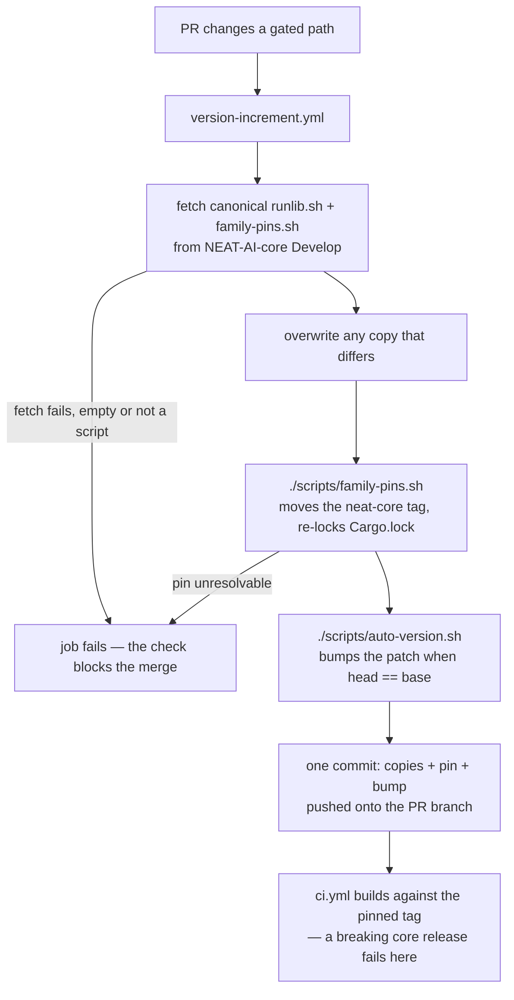

## Summary

Adopts NEAT-AI-core's canonical `scripts/runlib.sh` and `scripts/family-pins.sh`
byte-for-byte, replaces the sibling `path` dependency on `neat-core` with a git
dependency pinned to core's newest release tag (`v0.22.5`), and adds the
family-sync step to `version-increment.yml` so one CI commit carries the
refreshed copies, the moved pin and the crate-version bump. The
`setup-neat-core` composite action, `scripts/check-neat-core-version.sh` and
`neat-core.expected-version` are retired: the pin is the gate, and a breaking
core release now turns the adopting PR's CI build red. Closes #107.

## Evidence

Backend/CLI change — no web interface to screenshot. What was run:

* **Byte-identity** — both copies re-fetched from
  `NEAT-AI-core/Develop` after committing and `cmp`'d:
  `runlib.sh: byte-identical to core Develop`,
  `family-pins.sh: byte-identical to core Develop`
  (sha256 `a74d8ac9…f220e` for `runlib.sh` on both sides).
* **Builds with no sibling checkout** — there is no `../NEAT-AI-core` in this
  worktree; `cargo build --workspace` finished after
  `Compiling neat-core v0.22.5 (https://github.com/stSoftwareAU/NEAT-AI-core?tag=v0.22.5#771ad136)`.
* **A behind pin is moved** — the tag was set back to `v0.22.3` and
  `./scripts/family-pins.sh` run:
  `[family-pins] neat-core v0.22.3 → v0.22.5 (rebase/Cargo.toml)` /
  `[family-pins] 1 pin(s) moved; Cargo.lock updated`, with `Cargo.lock` moving
  to `git+…?tag=v0.22.5#771ad136…`. Re-running on the current pin exits 0 and
  changes nothing (idempotent).
* **The install contract** — `./scripts/runlib.sh` run for real:
  first run installed `$CARGO_HOME/bin/neat_ai_rebase`, wrote
  `.neat-ai-rebase.version` (`0.1.1`) and reported
  `removed …/target (freed 326533120 bytes)`; the second run printed
  `[neat-ai-rebase] already installed v0.1.1` and ran no cargo command.
* **Gates** — `./quality.sh` exits 0 (shellcheck over both copied scripts,
  `test-runlib.sh` 9/9, actionlint, `cargo deny check` → `sources ok`, fmt,
  clippy, full test suite, rustdoc). `markdownlint-cli2` reports 0 issues.

## Acceptance Criteria

<!-- vibe-spec-review inputs="diff+issue-body" -->

- **met** — Both copies are byte-identical to core's; stale copies on a PR are
  refreshed by CI — evidence: `cmp` against
  `raw.githubusercontent.com/stSoftwareAU/NEAT-AI-core/Develop/scripts/*`;
  refresh step at `.github/workflows/version-increment.yml:106-139`; both
  scripts added to the gated `paths:` (`version-increment.yml:64-65`) —
  reviewer: met — reason: the reviewer noted the refresh fires only on PRs whose
  changed paths hit the gate, so a docs-only PR does not re-sync; the issue's own
  note leaves that trigger choice to the repo and this keeps the sync, the pin
  and the bump in one commit, which the next criterion requires.
- **met** — The workspace builds with no `NEAT-AI-core` checkout beside the
  repo; a behind pin is moved and the patch bumped in one CI commit — evidence:
  `rebase/Cargo.toml:27`, `Cargo.lock` `git+…?tag=v0.22.5`, the `v0.22.3 →
  v0.22.5` run above, and the single staged commit at
  `.github/workflows/version-increment.yml:182-214`;
  `rebase/tests/family_sync.rs::version_increment_syncs_the_helpers_before_it_bumps`
  and `::version_increment_commits_the_refreshed_copies_with_the_bump` —
  reviewer: met — reason: the reviewer's caveat that the sync commit gets no CI
  run of its own under the `GITHUB_TOKEN` fallback is real and is now documented
  at `version-increment.yml:173-180`, `README.md:86-89` and `CONTRIBUTING.md:162`.
- **met** — `./scripts/runlib.sh` installs `~/.cargo/bin/neat_ai_rebase` and
  `.neat-ai-rebase.version`, removes `target/`; a second run prints
  `[neat-ai-rebase] already installed v<x>` and runs no cargo command —
  evidence: the two real runs quoted in Evidence, plus
  `scripts/test-runlib.sh` (9 assertions, including "already-installed ran no
  cargo command" against a logging cargo shim) — reviewer: partial — reason:
  departed. The reviewer saw only the diff and could not run the installer; it
  was run here and both halves hold. The install-and-remove half has no
  automated test in this repo by design — `runlib.sh` is core's file and core
  owns its install tests; duplicating them here would mean a release build in
  every `quality.sh` run.
- **met** — Tests and quality checks pass — evidence: `./quality.sh` exit 0
  after the final edit; `cargo test --workspace --all-features` green —
  reviewer: met.
- **unrequested** — `.github/workflows/sbom.yml` and `cargo-audit.yml` updated —
  reviewer: unrequested — reason: `sbom.yml` used the deleted `setup-neat-core`
  action, so retiring the action required it; `cargo-audit.yml` carried a
  comment about a sibling checkout that no longer exists.
- **unrequested** — `deny.toml` `allow-git` widened to the NEAT-AI-core
  repository — reviewer: unrequested — reason: `cargo deny check` fails the git
  source otherwise (`source-not-allowed`); scoped to that one repository with
  `unknown-git = "deny"` retained.
- **unrequested** — `CONTRIBUTING.md`, root `Cargo.toml` and
  `scripts/crates-quarantine.sh` comments updated — reviewer: unrequested —
  reason: each stated that `neat-core` is a sibling `path` dependency, which the
  code change makes false.
- **unrequested** — `rebase/tests/family_sync.rs` added and
  `scripts/test-runlib.sh` rewritten — reviewer: unrequested — reason: the
  canonical `runlib.sh` changes the stamp name and entry contract, so the old
  test no longer described it; the new tests are this change's regression cover.

## Standards Review

<!-- vibe-standards-review inputs="diff+CODING-STANDARDS.md" -->

- **violation** — the family-sync ordering test was satisfied by the workflow's
  header prose rather than by the steps — evidence:
  `rebase/tests/family_sync.rs:122` — reason: fixed here. `step_running` skips
  comment lines and resolves the declared step index, and
  `step_running_ignores_the_header_prose` pins exactly that failure mode.
- **violation** — `test-runlib.sh`'s second case claimed a build attempt it
  never reached (the shim refused `cargo metadata` first) — evidence:
  `scripts/test-runlib.sh:91` — reason: fixed here. The shim now answers
  `cargo metadata` and the case asserts the exact
  `cargo build --release --package neat-ai-rebase --bin neat_ai_rebase`.
- **violation** — `scripts/crates-quarantine.sh` claimed non-registry packages
  are "reported as skipped, never silently passed"; the code drops them —
  evidence: `scripts/crates-quarantine.sh:15` — reason: comment corrected to
  what the code does and why `neat-core`, an internal `stSoftwareAU` dependency
  moved by `family-pins.sh`, needs no crates.io quarantine. The behaviour is
  unchanged — widening the gate is a separate concern.
- **violation** — stale docs after the pin change: root `Cargo.toml` and
  `cargo-audit.yml` still described a sibling checkout — evidence:
  `Cargo.toml:1`, `.github/workflows/cargo-audit.yml:11` — reason: fixed here.
- **violation** — `README.md` hardcoded `tag = "v0.22.5"`, which
  `family-pins.sh` rewrites on the next pin move — evidence: `README.md:74` —
  reason: fixed here; the block now shows the pin *shape* (`v<latest>`).
- **violation** — docs claimed a breaking core release "fails that PR's CI
  build" without the `ACTIONS_PUSH` caveat the workflow itself documents —
  evidence: `README.md:88`, `CONTRIBUTING.md:163` — reason: fixed here; both,
  and the workflow comment, now state that a `GITHUB_TOKEN` push starts no run
  and the next push to the PR is what builds the moved pin.
- **violation** — the sync fetches from core's mutable `Develop` branch and
  executes the freshly downloaded `family-pins.sh` in a job holding
  `contents: write` — evidence: `.github/workflows/version-increment.yml:108`
  — reason: stands. "Byte-identical to core's `Develop`" is the copy contract
  the issue and core's own header mandate, and pinning the fetch to a core
  commit SHA would defeat it; NEAT-AI-core is an internal `stSoftwareAU`
  repository, the payload is validated (`--fail`, non-empty, shebang) and the
  same design is what the sibling repositories run. Changing it is a family-wide
  decision made in core, not downstream.
- **violation** — two tests exercise helpers defined in the test file
  (`inline_value`, `is_release_tag`) — evidence:
  `rebase/tests/family_sync.rs:62` — reason: stands, and deliberately. Rust
  integration tests are separate crates, so every workflow test file in this
  repo carries and validates its own reader (`version_release_workflows.rs:157`,
  `workflow_branch_filters.rs`); an unvalidated reader is how the ordering test
  above came to pass vacuously.
- **clean** — Australian English throughout; `set -euo pipefail` in every
  multi-line `run:`; no `${{ github.* }}` interpolation inside a run script
  (every value arrives via `env:`); actions SHA-pinned with version comments;
  `permissions: contents: read` at workflow level with `contents: write` scoped
  to the pushing job; `persist-credentials: false` retained; fail-loud sync
  (`curl --fail`, empty-payload and shebang checks, fork path exits 1 rather
  than skipping green); no hidden or credential-shaped paths staged; the copied
  helpers carry no local edit.

## Test Plan

- `rebase/tests/family_sync.rs` (new, 8 tests):
  `neat_core_is_pinned_to_a_core_release_tag` (no `path =`, the core git URL, a
  `v<major>.<minor>.<patch>` tag), `cargo_lock_resolves_the_pinned_tag`
  (lockfile and manifest name the same tag),
  `version_increment_syncs_the_helpers_before_it_bumps` (the fetch and pin steps
  precede the bump step),
  `version_increment_commits_the_refreshed_copies_with_the_bump` (the commit
  stages all four paths), `copied_helpers_refuse_an_unknown_argument` (both
  scripts really run and exit 2), plus the three reader tests
  (`inline_value_reads_one_key_of_a_declaration`,
  `release_tags_exclude_pre_releases_and_branches`,
  `step_running_ignores_the_header_prose`).
- `rebase/tests/version_release_workflows.rs::version_increment_watches_every_gated_path`
  extended with `scripts/runlib.sh` and `scripts/family-pins.sh`.
- `scripts/test-runlib.sh` rewritten for the canonical script: the
  already-installed skip (exit 0, the bin path on stdout, the
  `[neat-ai-rebase] already installed v<x>` line, an empty cargo log) and the
  stale-stamp path (reaches `cargo build` for the crate's own bin, fails loud,
  leaves the installed binary and stamp untouched). Documented modification:
  the previous version asserted `HOME`-based paths and the stamp
  `.neat_ai_rebase.version`, both of which the canonical `runlib.sh` replaces
  (`CARGO_HOME`, `.neat-ai-rebase.version`).
- Red-before-green: with the pre-change `version-increment.yml` restored, both
  `version_increment_*` tests fail; `step_running_ignores_the_header_prose`
  fails against the earlier substring-based reader.
