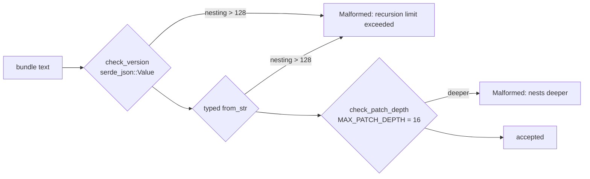

## Summary

Pins down, with tests, that parsing an untrusted bundle is already bounded before it can build a tree. Closes #120.

The issue said a deeply nested `split` chain would overflow the stack inside `serde_json::from_str`, before `check_patch_depth` runs. That does not happen. `serde_json::from_str` (default features, no `unbounded_depth`) has a built-in limit of 128 nesting levels. Deeper input stops the parse with a `recursion limit exceeded` error. `check_version` (untyped read) and the typed read in `Enhancement::parse_json` / `EnhancementBundle::parse_json` both go through `from_str`, so a pathological document fails closed as `EnhancementError::Malformed`. Only a tree within the limit gets built, and `check_patch_depth` then refuses it if it is deeper than `MAX_PATCH_DEPTH`.

The existing test covered only the single-enhancement shape. This PR:

- adds the bundle shape
- adds the deepest tree the parser still builds
- documents on `check_patch_depth` where the parse-time bound comes from, so the finding is not raised again

## Evidence

This is a backend/library change with no UI. `cargo test --test patch_depth_limit` shows 9 passed. `./quality.sh` passed.

Both new tests also passed on the code before this change, which confirms the issue's premise is wrong. They are regression guards: a move to an unbounded parser (for example `Deserializer::disable_recursion_limit`) would make them fail.

## Test Plan

- `rebase/tests/patch_depth_limit.rs::a_pathologically_nested_bundle_fails_closed`: a 100,000-level bundle is refused with `Malformed`, and the reason names serde_json's recursion limit.
- `rebase/tests/patch_depth_limit.rs::the_deepest_parseable_tree_is_refused_by_the_depth_guard`: a 100-level tree, under serde's limit in both shapes, is fully parsed and then refused by the depth guard (`nests deeper`) with no overflow.

🤖 Generated with [Claude Code](https://claude.com/claude-code)
