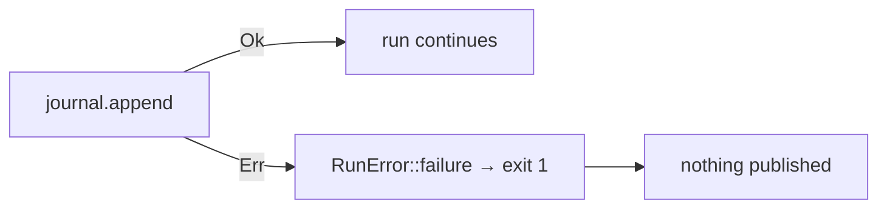

# PR Summary — Issue #121

## Summary

Closes #121

In `rebase/src/cli.rs`, five `journal.append(...)` calls threw away their
`Result` with `let _ =`. That broke `Journal::append`'s own promise that
failures are "reported, never swallowed". A run could therefore exit
`EXIT_NO_IMPROVEMENT`, or publish `population-candidate.json`, without
recording it in `experiments.jsonl`.

Each call now uses `.map_err(RunError::failure)?`, the same pattern
`append_outcome` and `finish` already use:

| Record    | Path                                   |
| --------- | -------------------------------------- |
| `Result`  | harvest found nothing (`nothingToDo`)  |
| `Opening` | every rebase run                       |
| `Dropped` | screen skipped, the cohort fits the budget |
| `Verdict` | after the authoritative judge          |
| `Screen`  | each screen phase, in `fn screen`      |

The harvest path also re-created a second `Journal` for the same file. That
duplicate is gone; the path now uses the run's journal.

- [x] Failing tests written first
- [x] All five call sites propagate
- [x] `cargo fmt`, `cargo clippy -D warnings`, `cargo test` clean
- [x] `./quality.sh`

## Evidence

This is a CLI/backend change, so there are no screenshots. Before the fix,
both new tests in `rebase/src/cli.rs` failed:

- `cli::tests::an_unwritable_journal_fails_a_harvest_with_nothing_to_do`:
  `run_with` returned `Ok(3)` with an unwritable journal.
- `cli::tests::an_unwritable_journal_stops_the_run_before_a_candidate_is_published`:
  `population-candidate.json` was written after the `Verdict` append had
  failed.

After the fix, both return `EXIT_FAILURE` with the journal path in the
message, and nothing is published.

## Test Plan

- `cargo test --lib an_unwritable_journal`: the two regression tests
- `cargo test`: the full suite
- `./quality.sh < /dev/null`
