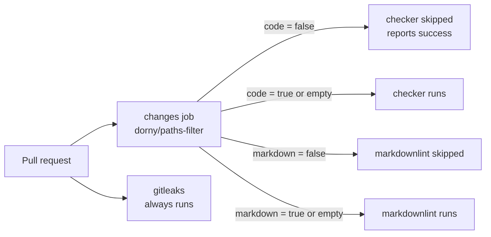

# PR Summary — Issue #123: gate PR checkers on a job-level changes filter

## Summary

Closes #123

Until now, eight `pull_request` workflows ran on every PR, docs-only PRs included.
Seven of them now start with a `changes` job built on SHA-pinned
`dorny/paths-filter` (v4.0.3, `pull-requests: read` only), and their expensive
jobs are gated on its verdict:

- **Code filter:** anything outside `docs/**` and `**/*.md` counts as code. It is
  used by `actionlint`, `cargo-audit`, `ci`, `dependency-review`, `sbom` and
  `semgrep`.
- **Markdown filter:** `markdown-lint` inverts the check. It runs when any `*.md`
  page, `.markdownlint-cli2.jsonc` or its own workflow changes.
- **Always on:** `gitleaks` has no gate, because a secret can land in a docs page
  as easily as in code.

The gate is a job-level `if:`, never a workflow `paths:`. GitHub reports a
skipped job as success to branch protection, but a workflow that never runs
reports nothing and blocks the merge. The gate also fails open, using
`!cancelled() && needs.changes.outputs.<filter> != 'false'`. On a schedule, on a
dispatch, or when classification fails, the output is empty rather than
`'false'`, so the job runs.

## Evidence

- `cargo test --test workflow_change_gates`: 9 passed.
- These existing workflow suites still pass: `workflow_concurrency`,
  `workflow_branch_filters`, `workflow_push_triggers`, `security_alerting`,
  `sbom_gate`, `actionlint_gate` and `version_release_workflows`.
- `./scripts/actionlint.sh` exits 0.
- `./quality.sh`: "All quality checks passed!"

## Test Plan

`rebase/tests/workflow_change_gates.rs` parses the committed workflows. It does
not grep them. It asserts that:

- none of the eight uses a workflow-level `paths:` filter
- every gated workflow has a `changes` job using a SHA-pinned, read-only
  `dorny/paths-filter`
- every other job `needs: changes` and uses the fail-open `if:`
- the code filter skips `README.md`, `docs/evidence/screenshot.png` and
  `rebase/src/notes.md` but fires on
  `rebase/src/lib.rs`, `Cargo.toml` and `.github/workflows/ci.yml`
- the markdown filter fires on any `*.md` page, its config and its workflow
- `gitleaks.yml` has no gate

## Checklist

- [x] `changes` job added to the seven checker workflows
- [x] Markdown-specific filter for `markdown-lint.yml`
- [x] `gitleaks.yml` left always on, with a comment saying why
- [x] Rust integration tests added
- [x] `CONTRIBUTING.md` documents the gate
- [x] `./quality.sh` passes

## Security self-check

- [x] The new action is pinned to a 40-character SHA with a tag comment
- [x] The `changes` job is granted only `pull-requests: read`
- [x] No `${{ github.* }}` inside `run:` blocks and no new secrets
- [x] No hidden or credential files staged
