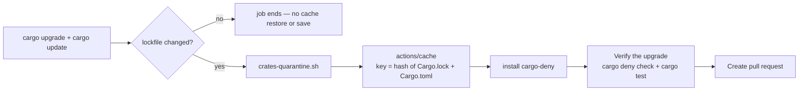

# Cache Cargo dependencies in the weekly upgrade job

## Summary

When the weekly bump moved the lockfile, the `upgrade` job in
`.github/workflows/cargo-upgrade.yml` ran `cargo deny check` and
`cargo test --workspace --all-features` with no cache. Every run downloaded all
the crates again, inside a 30-minute ceiling.

This adds the cache step `ci.yml` already uses, with the same pin
(`actions/cache@27d5ce7f… # v5`), paths (`~/.cargo/registry`, `~/.cargo/git`),
key (`${{ runner.os }}-cargo-${{ hashFiles('**/Cargo.lock', '**/Cargo.toml') }}`)
and `restore-keys` fallback (`${{ runner.os }}-cargo-`). Because they match,
the two workflows share one cache. Two placement choices matter:

* **The cache is restored after the bump and before `Verify the upgrade`.** The
  key therefore hashes the lockfile the suite actually builds, and the refreshed
  crates are saved under it.
* **It is gated on `steps.changes.outputs.changed == 'true'`.** A run with
  nothing to propose neither restores nor saves a cache.

On the pin: `v5` now resolves to a newer commit than the one `ci.yml` pins.
This change reuses `ci.yml`'s SHA (verified with
`gh api repos/actions/cache/commits/27d5ce7f…`) so the two workflows stay on the
same action version. Moving both is left to the normal dependency-bump flow.

Closes #124.

## Evidence

This is a CI configuration change with no web interface, so there is no
screenshot. The evidence is the new tests, which read the committed workflow,
plus `actionlint` and the full local gate.

## Test Plan

`rebase/tests/cargo_upgrade_cache.rs` is new, with 6 checks. Each one parses
the `upgrade` job's steps from the committed workflow. Before the workflow
change all 6 failed; after it all 6 pass.

* `the_upgrade_job_caches_the_cargo_registry_and_git_checkouts`: the paths are
  `~/.cargo/registry` and `~/.cargo/git`.
* `the_cache_key_tracks_the_lockfile_and_manifests_with_a_fallback`: the exact
  key and the `restore-keys` fallback.
* `the_cache_matches_ci_so_the_two_workflows_share_one_cache`: `uses:`, `key:`,
  `path:` and `restore-keys:` all equal `ci.yml`'s `quality` job.
* `the_cache_action_is_pinned_to_a_full_commit_sha`: a 40-character SHA pin.
* `the_cache_is_restored_after_the_bump_and_before_verification`: step order.
* `the_cache_is_skipped_when_the_bump_changed_nothing`: the
  `steps.changes.outputs.changed == 'true'` gate.

Gate results: `./scripts/actionlint.sh` is clean, and `./quality.sh` passes end
to end (`cargo fmt --check`, clippy, the full test suite, `cargo deny`, the doc
build).

## Checklist

- [x] Failing test written first
- [x] Cache step added to `cargo-upgrade.yml`
- [x] `actionlint`, fmt and clippy clean
- [x] `./quality.sh` passes
- [x] PR summary committed

## Security self-check

- [x] Action pinned to a verified 40-character SHA, the same one `ci.yml` uses.
- [x] No permissions widened: the job keeps its existing scoped set.
- [x] No `${{ github.* }}` interpolated into `run:`, and no new `run:` block.
- [x] No secrets or hidden files staged.
