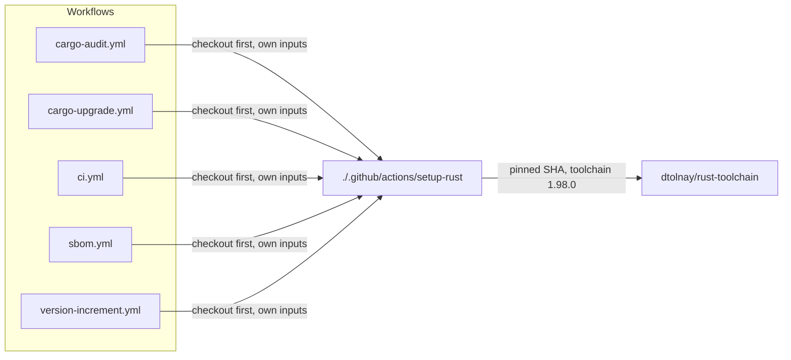

# PR Summary — Issue #125: one shared Rust toolchain setup

## Summary

Closes #125.

Five workflows (`cargo-audit.yml`, `cargo-upgrade.yml`, `ci.yml`, `sbom.yml`,
`version-increment.yml`) each carried their own copy of the
`dtolnay/rust-toolchain` SHA and the `1.98.0` version. A toolchain bump meant
editing all five. The pin now lives in one local composite action,
`.github/actions/setup-rust/action.yml`, and every workflow calls it.
`ci.yml` still asks for `rustfmt, clippy` through the action's `components`
input.

**Deviation from the issue's suggestion:** checkout was kept out of the action.
A local action (`uses: ./.github/actions/…`) only exists once the repository has
been checked out, so the checkout cannot sit inside it. Each workflow therefore
keeps its own "Checkout code" step, with its own inputs unchanged:
`ref: Develop` in `cargo-upgrade.yml`; the PR head SHA and `fetch-depth: 0` in
`version-increment.yml`; `persist-credentials: false` everywhere.

`.github/actions/setup-rust/action.yml` is added to the `version-increment.yml`
`paths:` list. The gate's toolchain pin used to live in that workflow, so a pin
change triggered the gate. This keeps that true now the pin has moved.

## Evidence

This is a CI-only change with no visual surface, so there is no screenshot.

## Test Plan

- [x] New `rebase/tests/setup_rust_action.rs` parses the committed YAML and
      asserts that:
  - the action is composite and pins the installer by a 40-hex SHA with a
    version comment
  - its toolchain matches the `rust-toolchain.toml` channel
  - no workflow calls `dtolnay/rust-toolchain` directly
  - each Rust workflow checks out before calling the action
  - each checkout keeps its own inputs
  - CI still requests `rustfmt, clippy`

  Written first: 6 of 7 tests failed before the change.
- [x] `version_increment_watches_every_gated_path` now covers the action file.
      It failed before the `paths:` addition.
- [x] `./scripts/actionlint.sh` passes.
- [x] `./quality.sh` passes.

## Checklist

- [x] Every `uses:` stays pinned to a full commit SHA with a version comment.
- [x] `permissions:` and `persist-credentials: false` are unchanged.
- [x] Only the toolchain step moved; no other behaviour changed.

## Follow-up (out of scope)

`ci.yml` pins `actions/checkout@93cb6efe… # v5`, while the other workflows pin
`@3d3c42e5… # v7.0.1`. That inconsistency is left for a separate change.

## Security self-check

- [x] No secrets or hidden files staged beyond `.github/`.
- [x] No new third-party action; the existing `dtolnay/rust-toolchain` SHA is reused
      verbatim.
- [x] No `${{ github.* }}` expressions added inside `run:` blocks.
