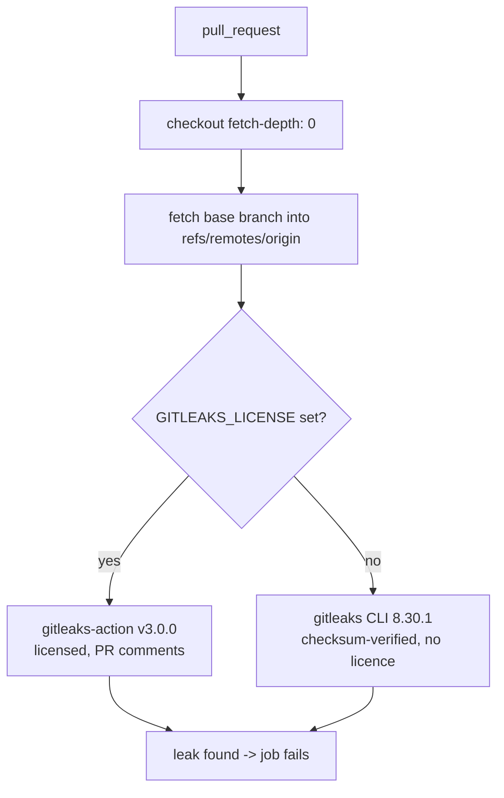

# Add Gitleaks secrets detection workflow

## Summary

Adds `.github/workflows/gitleaks.yml`, which scans every pull request's commit
range for committed secrets. Closes #13.

The repository is org-owned (`stSoftwareAU`), and `gitleaks-action` requires an
organisation licence on org-owned repos — I confirmed that is still true for
v3.0.0, not just v2, by reading the pinned action's own README. Runs that never
receive Actions secrets (Dependabot PRs) would therefore exit with `ErrLicense`
and gate nothing, so the workflow branches on the licence:



Two deviations from the template in the issue, both deliberate:

- **The base-branch fetch fails loud.** The template ends that step with
  `|| true`, which swallows a genuine fetch failure. It fetches into the
  remote-tracking ref with `--force` instead
  (`+refs/heads/$BASE_REF:refs/remotes/origin/$BASE_REF`), which is idempotent
  and cannot collide with a local branch, so there is nothing left worth
  ignoring — a fetch that really fails now fails the job.
- **`persist-credentials` is left at its default**, unlike `ci.yml`, because
  that step re-reads the base branch from the remote. The comment in the file
  says so, so the difference from `ci.yml` does not read as an oversight.

Every third-party reference is pinned to a 40-character commit SHA and was
verified against the GitHub API before committing, not copied on trust:

| Pin | Verified |
| --- | --- |
| `actions/checkout@3d3c42e5aac5ba805825da76410c181273ba90b1` | `git/ref/tags/v7.0.1` resolves to that exact commit |
| `gitleaks/gitleaks-action@e0c47f4f8be36e29cdc102c57e68cb5cbf0e8d1e` | `git/ref/tags/v3.0.0` resolves to that exact commit |
| `gitleaks` CLI 8.30.1 SHA-256 `551f6fc8…70eb` | matches upstream `gitleaks_8.30.1_checksums.txt`; 8.30.1 is the latest release |

`CONTRIBUTING.md` gains a short note that CI runs this gate on top of
`./quality.sh`, and that a flagged credential must be rotated rather than
rebased away.

## Evidence

No web interface to screenshot — this is a CI configuration change. It was
verified by running the tooling rather than by inspection.

**Workflow lints clean** (`actionlint` is installed in this container):

```text
$ actionlint .github/workflows/gitleaks.yml
actionlint: OK
```

**The fallback CLI path was executed end to end**, using the exact commands the
workflow runs. The download and checksum verification:

```text
$ curl -sSfL .../gitleaks_8.30.1_linux_x64.tar.gz -o "$archive"
$ echo "${GITLEAKS_SHA256}  ${archive}" | sha256sum -c -
gitleaks_8.30.1_linux_x64.tar.gz: OK
```

Then the scan itself, in both directions (this container is `aarch64`, so the
`linux_arm64` build of the same 8.30.1 release was used to execute the scan;
the x64 archive named in the workflow is the one whose checksum is verified
above):

| Case | Command | Result |
| --- | --- | --- |
| This PR's own commit range | `gitleaks git --redact --no-banner --exit-code 1 --log-opts="$BASE..$HEAD" .` | `no leaks found`, exit `0` |
| Range with a planted AWS key | same command, throwaway repo | `leaks found: 1`, exit `1` |

The negative case is the one that matters: a workflow that never fails is not a
gate. The finding was printed redacted, confirming `--redact` keeps the secret
out of the public build log.

**The fetch step was executed** against this checkout, not just read:

```text
$ git fetch --no-tags --force origin "+refs/heads/Develop:refs/remotes/origin/Develop"
fetch step: OK
```

**Repository gate is green** — `./quality.sh < /dev/null` ends with
`All quality checks passed!` (fmt, clippy with `-D warnings`, 15 workspace
tests plus 2 doctests, cargo-deny, doc build, shellcheck).

## Test Plan

No Rust tests were added: the deliverable is a GitHub Actions configuration
file, and a Rust test asserting on YAML text would verify nothing the tooling
above does not verify for real. What was run instead:

- `actionlint .github/workflows/gitleaks.yml` — parses and validates the
  workflow, its expressions and its action references.
- The fallback step's own commands, executed verbatim: checksum-verified
  download, then a scan of this PR's commit range (clean, exit 0) and of a
  range containing a planted AWS key (detected and redacted, exit 1).
- The base-branch fetch command, executed against this checkout.
- `./quality.sh < /dev/null` — full repository gate, passing.
