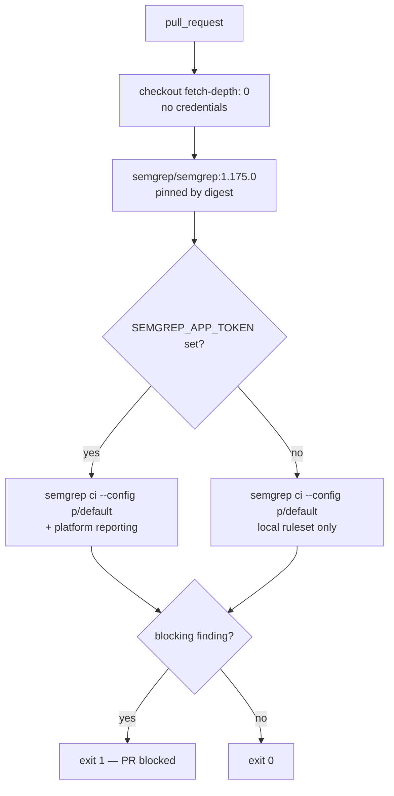

# Add Semgrep SAST scanning workflow

## Summary

Adds `.github/workflows/semgrep.yml`, which runs the Semgrep `p/default`
static-analysis ruleset over every pull request and fails the PR on any
blocking finding. Closes #14.

Three deliberate deviations from the template in the issue:

- **Semgrep is bumped to the current release, 1.175.0**, from the template's
  1.173.0, and re-pinned to that release's own digest. 1.175.0 was published
  2026-08-26, so it is outside the 24-hour external-dependency quarantine.
- **`fetch-depth: 0` on the checkout.** `semgrep ci` resolves the pull
  request's merge base to scan diff-aware; with the default shallow clone it
  has to re-fetch the base branch mid-scan
  (`semgrep/meta.py::_shallow_fetch_branch`). Giving it the full history up
  front makes the scan self-contained.
- **`persist-credentials: false`**, matching `ci.yml`. This repository is
  public, so any fetch Semgrep still chooses to make succeeds anonymously —
  unlike `gitleaks.yml`, no credential needs to survive the checkout step.

`SEMGREP_APP_TOKEN` is kept as an optional passthrough. The repository has no
Actions secrets of its own, so today it expands to an empty string and the scan
runs on the pinned ruleset alone — verified below, not assumed. That also
covers Dependabot pull requests, which are never given Actions secrets. If the
organisation adds the token later, findings additionally flow to the Semgrep
AppSec Platform. The gate cannot silently become a no-op either way.



Both third-party references were verified against their registries before
committing, not copied on trust:

| Pin | Verified |
| --- | --- |
| `actions/checkout@3d3c42e5aac5ba805825da76410c181273ba90b1` | `git/ref/tags/v7.0.1` resolves to that exact commit, and v7.0.1 is the latest release |
| `semgrep/semgrep:1.175.0@sha256:b94b53d0…e796` | Docker Hub registry returns that digest for tag `1.175.0`, and the same digest resolves back to the multi-arch index (`amd64` included) |

`CONTRIBUTING.md` now lists both CI-only gates and says what to do with a
Semgrep finding, including the `# nosemgrep: <rule-id>` escape for a genuine
false positive.

## Evidence

No web interface to screenshot — this is a CI configuration change, verified by
running the tooling rather than by reading it.

**Workflow lints clean:**

```text
$ actionlint .github/workflows/semgrep.yml
actionlint: OK
```

**The scan command was executed verbatim**, at the pinned version (1.175.0,
installed from the published wheel), with `SEMGREP_APP_TOKEN` set to the empty
string — the exact state CI is in today with no secret configured:

```text
$ SEMGREP_APP_TOKEN="" semgrep ci --config p/default
  Scanning 51 files tracked by git with 1074 Code rules:
  Language      Rules   Files
  <multilang>      47      51
  rust              4      24
  yaml             35       4
  bash              4       2
 • Findings: 0 (0 blocking)
 • Rules run: 1074
  No blocking findings so exiting with code 0
EXIT=0
```

This repository is clean, and the new workflow file is itself in the scanned
set (yaml went from 3 files to 4) — Semgrep's GitHub Actions rules do not flag
it.

**The negative case is the one that matters**, since a workflow that never
fails is not a gate. The same command, in a throwaway repository containing one
workflow that interpolates `github` context data straight into a `run:` step:

```text
$ SEMGREP_APP_TOKEN="" semgrep ci --config p/default
  Has findings for blocking rules so exiting with code 1
  ❯❯❱ yaml.github-actions.security.run-shell-injection.run-shell-injection
        7┆ - run: echo "..."
EXIT=1
```

**Repository gate is green** — `./quality.sh < /dev/null` ends with
`All quality checks passed!` (bash syntax, shellcheck, cargo-deny, `cargo fmt
--check`, clippy with `-D warnings`, 15 workspace tests plus 2 doctests, doc
build).

## Test Plan

No Rust tests were added, following the precedent set by
`docs/archive/pr-summaries/pr-summary-13.md`: the deliverable is a GitHub
Actions configuration file, and a Rust test asserting on its YAML text would
verify nothing that running the real tooling does not verify properly, while
breaking on any harmless edit. What was run instead:

- `actionlint .github/workflows/semgrep.yml` — parses and validates the
  workflow, its expressions and its action reference.
- `semgrep ci --config p/default` at the pinned 1.175.0, token-less, against
  this checkout — 1074 rules over 51 files, 0 findings, exit 0.
- The same command against a planted `run:`-injection finding — detected, exit
  1.
- Registry verification of both pins (GitHub API for the checkout SHA, Docker
  Hub registry manifest for the image digest).
- `./quality.sh < /dev/null` — full repository gate, passing.
