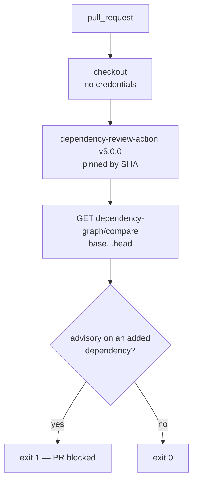

# Add Dependency Review workflow

## Summary

Adds `.github/workflows/dependency-review.yml`, which diffs the dependencies a
pull request introduces against GitHub's advisory database and fails the PR on
any advisory. Closes #15.

The workflow follows the template in the issue, with three deliberate
additions, all of which match the conventions `gitleaks.yml` and `semgrep.yml`
already set:

- **`persist-credentials: false` on the checkout.** The action reads the base
  and head SHAs from the event payload and calls the dependency-review API with
  `github.token`; it never fetches or pushes, so no git credential needs to
  survive the checkout step. Same reasoning as `ci.yml` and `semgrep.yml`.
- **`timeout-minutes: 10`**, matching `gitleaks.yml`, so a wedged API call
  cannot hold a runner for six hours.
- **`fail-on-severity: low` stated explicitly.** It equals the action's own
  default, but writing it down makes the threshold reviewable — a later PR that
  wants to weaken it has to say so in the diff rather than rely on a default
  nobody reads.

`pull-requests: write` was deliberately **not** granted. That permission only
buys `comment-summary-in-pr`; without it the job cannot write to the PR at all,
and findings still surface in the job log, the step summary and the failed
check.

This overlaps `cargo deny check` in `ci.yml` on purpose, and the two are not
redundant:

| | `cargo deny check` | Dependency Review |
| --- | --- | --- |
| Scope | whole resolved graph | only what the PR adds |
| Source | RustSec advisory DB | GitHub Advisory DB |
| Ecosystems | Cargo | Cargo **and** pinned GitHub Actions |

A vulnerable crate that lands in a PR therefore fails twice, and a vulnerable
**action** pin — which cargo-deny cannot see at all — now fails once instead of
never.



Both pins in the issue template were verified against the GitHub API before
committing, not copied on trust:

| Pin | Verified |
| --- | --- |
| `actions/checkout@3d3c42e5aac5ba805825da76410c181273ba90b1` | `git/ref/tags/v7.0.1` resolves to that commit; v7.0.1 is the latest release |
| `actions/dependency-review-action@a1d282b36b6f3519aa1f3fc636f609c47dddb294` | `git/ref/tags/v5.0.0` resolves to that commit; v5.0.0 is the latest release, published 2026-05-08 (outside the 24h quarantine) |

`CONTRIBUTING.md` now lists three CI-only gates instead of two, and says what to
do with a finding (upgrade past it; `allow-ghsas` only for a genuinely
inapplicable advisory, with a reason in the PR description).

## Evidence

No web interface to screenshot — this is a CI configuration change, verified by
running the pinned action itself rather than by reading its YAML.

**Workflow lints clean:**

```text
$ actionlint .github/workflows/dependency-review.yml
actionlint: OK
```

**The pinned SHA is the released action.** Cloning tag `v5.0.0` checks out
`a1d282b36b6f3519aa1f3fc636f609c47dddb294` — the SHA in the workflow — so the
`dist/index.js` exercised below is exactly the code CI will run.

**Positive path — this repository, real API, exit 0.** The action was run
locally against a real commit range in this repo, with `fail-on-severity: low`:

```text
$ node dist/index.js          # base 152a6b1 -> head 1eb4690
::group::Vulnerabilities
Dependency review did not detect any vulnerable packages with severity level "low" or higher.
::group::Dependency Changes
File: .github/workflows/gitleaks.yml
+ actions/checkout@3d3c42e5aac5ba805825da76410c181273ba90b1
+ gitleaks/gitleaks-action@e0c47f4f8be36e29cdc102c57e68cb5cbf0e8d1e
EXIT=0
```

**Negative path — a real vulnerable dependency, exit 1.** A workflow that never
fails is not a gate, so the same binary was pointed at a commit range that
genuinely introduces a vulnerable package
(`actions/dependency-review-action@a7c7f3b…b379e2e`, which bumps
`fast-xml-parser` to an advisory-affected version):

```text
$ node dist/index.js
::group::Vulnerabilities
package-lock.json » fast-xml-parser@5.3.6 – numeric entity expansion bypass (high severity)
  ↪ https://github.com/advisories/GHSA-8gc5-j5rx-235r
package-lock.json » fast-xml-parser@5.3.6 – entity expansion limits bypassed (moderate severity)
package-lock.json » fast-xml-parser@5.3.6 – XML comment / CDATA injection (moderate severity)
package-lock.json » fast-xml-parser@5.3.6 – stack overflow in XMLBuilder (low severity)
::error::Dependency review detected vulnerable packages.
EXIT=1
```

**The gate will actually see Cargo changes**, which is the failure mode worth
ruling out for a Rust repository — an action that only understood npm would be
a silent no-op here. Two checks, both against the live API:

```text
$ gh api repos/stSoftwareAU/NEAT-AI-Rebase/dependency-graph/sbom
66 packages — tempfile, clap, sha2, serde, serde_json, …

$ gh api repos/BurntSushi/ripgrep/dependency-graph/compare/master~40...master
[{"e":"actions","n":1},{"e":"cargo","n":89}]
```

This repository's `Cargo.lock` is indexed by the dependency graph, and the
compare endpoint the action calls returns `cargo`-ecosystem changes. The `path`
dependency on `neat-core` is simply absent from the graph — the action queries
the API and never resolves a build, so the sibling checkout is irrelevant to
it.

**Repository gate is green** — `./quality.sh < /dev/null` ends with
`All quality checks passed!` (bash syntax, shellcheck, cargo-deny,
`cargo fmt --check`, clippy with `-D warnings`, 15 workspace tests plus 2
doctests, doc build).

## Test Plan

No Rust tests were added, following the precedent set by
`docs/archive/pr-summaries/pr-summary-13.md` and `pr-summary-14.md`: the
deliverable is a GitHub Actions configuration file, and a Rust test asserting on
its YAML text would inspect source rather than verify behaviour — it would pass
on a workflow that never runs and break on a harmless edit. The behaviour was
pinned by executing the real action instead:

- `actionlint .github/workflows/dependency-review.yml` — parses and validates
  the workflow, its expressions and both action references.
- `actions/dependency-review-action` at the pinned SHA, run against a real
  commit range in this repository — 0 vulnerable packages, exit 0.
- The same binary against a range that introduces `fast-xml-parser@5.3.6` —
  four advisories reported, exit 1. The gate blocks.
- `dependency-graph/sbom` for this repo and `dependency-graph/compare` for a
  Rust repository — confirms Cargo dependencies are indexed and diffed.
- Registry verification of both pins via `git/ref/tags` on the GitHub API.
- `./quality.sh < /dev/null` — full repository gate, passing.
