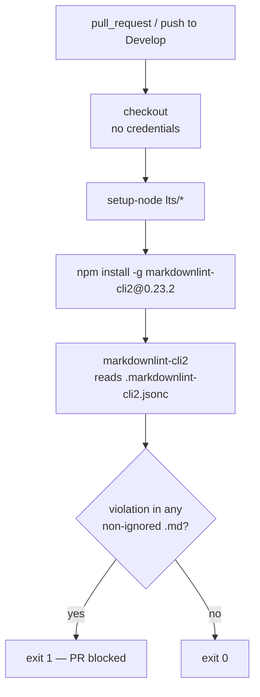

# Add Markdown Lint workflow

## Summary

Adds `.github/workflows/markdown-lint.yml`, which runs `markdownlint-cli2` over
every Markdown file in the repository and fails the PR on any violation.
Closes #16.

The repository already carries `.markdownlint-cli2.jsonc` — globs, ignores and
rule set — but nothing ran it. The workflow invokes the bare
`markdownlint-cli2` command with no flags, so CI and a local run read the same
config and cannot drift.

Deliberate deviations from the template in the issue:

- **`push` targets `Develop`, not `main`/`master`.** This repository's default
  branch is `Develop`; the template's branch list would have meant the push
  trigger never fired.
- **`markdownlint-cli2` is pinned to `0.23.2`**, the current release (published
  2026-07-27, outside the 24-hour external-dependency quarantine). An unpinned
  `npm install -g` would let a future release silently change what this gate
  enforces without a diff.
- **`persist-credentials: false` on the checkout**, matching `ci.yml` and
  `semgrep.yml`. The linter only reads the working tree — it never fetches or
  pushes — so no git credential needs to survive the checkout step.
- **`timeout-minutes: 10`** and a **`concurrency` group**, matching
  `gitleaks.yml` and `ci.yml`: a wedged npm install cannot hold a runner, and
  superseded pushes cancel.
- **The optional Deno `check-mermaid` steps were omitted.** They are guarded on
  `worker/deno/mod.ts`, which does not exist here — this is a Rust workspace
  with no Deno module — so the detect step would have evaluated to `false` on
  every run and the two guarded steps would always skip. Dead configuration is
  not carried.

Both action pins were verified against the GitHub API before committing, not
copied on trust:

| Pin | Verified |
| --- | --- |
| `actions/checkout@3d3c42e5aac5ba805825da76410c181273ba90b1` | `git/ref/tags/v7.0.1` resolves to that commit; v7.0.1 is the latest release |
| `actions/setup-node@820762786026740c76f36085b0efc47a31fe5020` | `git/ref/tags/v7.0.0` resolves to that commit; v7.0.0 is the latest release |

`CONTRIBUTING.md` now lists four CI-only gates instead of three, and says how to
reproduce this one locally (`npx markdownlint-cli2@0.23.2` — no flags, the
config file supplies everything).



## Evidence

No web interface to screenshot — this is a CI configuration change, verified by
running the pinned tooling rather than by reading its YAML.

**Workflow lints clean:**

```text
$ actionlint .github/workflows/markdown-lint.yml
actionlint: OK
```

**Positive path — this repository, exit 0.** The workflow's `run:` command,
executed verbatim at the pinned version:

```text
$ markdownlint-cli2
markdownlint-cli2 v0.23.2 (markdownlint v0.41.1)
Finding: **/*.md !target/** !node_modules/** !.git/** !docs/pr-summary-*.md !docs/archive/pr-summaries/pr-summary-*.md
Linting: 8 files
Summary: 0 issues in 0 files
EXIT=0
```

The eight linted files include `CONTRIBUTING.md` as edited by this PR.

**Negative path — a planted violation, exit 1.** A workflow that never fails is
not a gate, so the same command was run against this repository's config plus
one file with a skipped heading level and a malformed list marker:

```text
$ markdownlint-cli2
Linting: 1 file
Summary: 2 issues in 1 file
broken.md:3 error MD001/heading-increment Heading levels should only increment by one level at a time [Expected: h2; Actual: h3]
broken.md:5:1 error MD030/list-marker-space Spaces after list markers [Expected: 1; Actual: 2]
EXIT=1
```

**Repository gate is green** — `./quality.sh < /dev/null` ends with
`All quality checks passed!` (bash syntax, shellcheck, cargo-deny,
`cargo fmt --check`, clippy with `-D warnings`, 15 workspace tests plus 2
doctests, doc build).

## Test Plan

No Rust tests were added, following the precedent set by
`docs/archive/pr-summaries/pr-summary-13.md`, `pr-summary-14.md` and
`pr-summary-15.md`: the deliverable is a GitHub Actions configuration file, and
a Rust test asserting on its YAML text would inspect source rather than verify
behaviour — it would pass on a workflow that never runs and break on a harmless
edit. The behaviour was pinned by executing the real linter instead:

- `actionlint .github/workflows/markdown-lint.yml` — parses and validates the
  workflow, its expressions and both action references.
- `markdownlint-cli2` at the pinned 0.23.2 against this checkout — 8 files, 0
  issues, exit 0.
- The same command against a planted MD001/MD030 violation — both reported,
  exit 1. The gate blocks.
- Registry verification of both action pins via `git/ref/tags` on the GitHub
  API, and of the `markdownlint-cli2@0.23.2` publish date on the npm registry.
- `./quality.sh < /dev/null` — full repository gate, passing.
