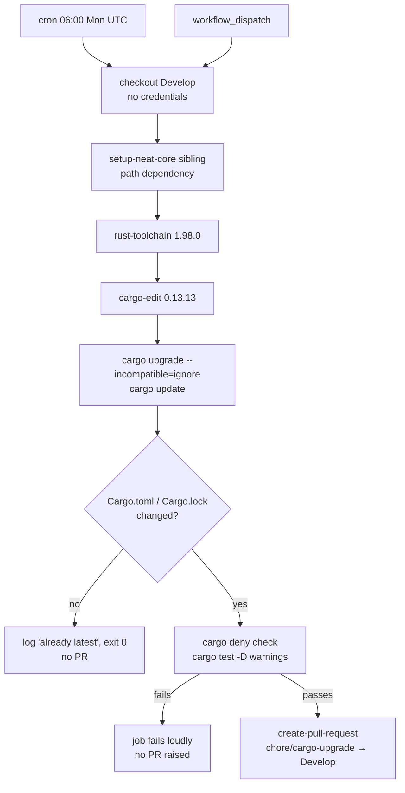

# Add Cargo Dependency Updates workflow

## Summary

Adds `.github/workflows/cargo-upgrade.yml`, a weekly job that runs
`cargo upgrade --incompatible=ignore --pinned=ignore` plus `cargo update`,
verifies the result, and proposes it as `chore/cargo-upgrade` against `Develop`
instead of pushing it. Closes #18.

The workflow follows the template in the issue and the sibling
`NEAT-AI-Forests` job of the same name, with four deviations this repository's
own conventions force:

- **The sibling `../NEAT-AI-core` checkout is required** —
  `.github/actions/setup-neat-core` is the second step. `cargo-audit.yml`
  deliberately omits it because `cargo audit` only parses `Cargo.lock`, but
  `cargo upgrade` and `cargo update` resolve the whole workspace, and
  `neat-core` is a `path` dependency. Verified below rather than assumed: both
  commands abort with `failed to load manifest for dependency 'neat-core'`
  without it.
- **`taiki-e/install-action` with `tool: cargo-edit@0.13.13`, not a bare
  `cargo install cargo-edit`** — the same install path and pin `ci.yml` and
  `cargo-audit.yml` use for cargo-deny and cargo-audit. An unpinned cargo-edit
  could change what this job rewrites without a diff. There is no cargo-edit
  manifest in install-action at that pin, so it installs 0.13.13 through the
  cargo-binstall fallback; the version is pinned either way.
- **The bump is verified before the PR is opened** — `cargo deny check` and
  `cargo test --workspace --all-features` under `RUSTFLAGS: -D warnings`. This
  is the fail-loud path that matters: when `ACTIONS_PUSH` is unset the PR is
  opened with `GITHUB_TOKEN`, and GitHub then suppresses the downstream
  workflow runs, so a broken bump would otherwise arrive with no CI on it at
  all. A failure fails this run and no PR is raised.
- **Toolchain pinned to `1.98.0`** at the `dtolnay/rust-toolchain` SHA `ci.yml`
  and `cargo-audit.yml` already use — `rust-toolchain.toml` pins the channel
  anyway, so `stable` would only make rustup download 1.98.0 a second time.

Scope choices worth a reviewer's attention:

- `--incompatible=ignore` keeps this to semver-compatible bumps. A major bump
  is a code change, not a version-number change, so it stays a deliberate PR;
  the run reports the crate as `incompatible` in its log (today: `sha2`).
- `neat-core` is untouched. It is a `path` dependency with no version
  requirement, so cargo-edit classifies it as `local` — the
  `neat-core.expected-version` baseline gate keeps its own separate contract.
- No release-age quarantine is implemented here: cargo-edit has none, and this
  workflow never merges anything. Human review plus the PR gates
  (`ci.yml`, `dependency-review.yml`, `cargo-audit.yml`) are what stop a crate
  published minutes ago from landing.
- `contents: write` / `pull-requests: write` are scoped to the job, not the
  workflow, and the checkout keeps `persist-credentials: false` —
  create-pull-request configures its own credential from the `token` input
  (`src/create-pull-request.ts` calls `gitConfigHelper.configureToken`), so no
  ambient push credential needs to survive the checkout step.

All four action pins were verified against the GitHub API before committing:

| Pin | Verified |
| --- | --- |
| `actions/checkout@3d3c42e5aac5ba805825da76410c181273ba90b1` | `git/ref/tags/v7.0.1` resolves to that commit; same pin as `cargo-audit.yml` |
| `dtolnay/rust-toolchain@29eef336d9b2848a0b548edc03f92a220660cdb8` | commit exists; identical to the pin in `ci.yml` |
| `taiki-e/install-action@7a79fe8c3a13344501c80d99cae481c1c9085912` | `git/ref/tags/v2.81.10` resolves to that commit; identical to the pin in `ci.yml` |
| `peter-evans/create-pull-request@5f6978faf089d4d20b00c7766989d076bb2fc7f1` | `git/ref/tags/v8.1.1` resolves to that commit; v8.1.1 is the latest release (published 2026-04-10, well outside the 24h quarantine) |
| `cargo-edit@0.13.13` | latest release on crates.io, published 2026-07-15, not yanked |

`CONTRIBUTING.md` gains a paragraph under **Dependencies** saying when the job
runs, how to reproduce it locally, and what it deliberately will not bump.



## Evidence

No web interface to screenshot — this is a CI configuration change, verified by
running the real tools the workflow runs rather than by reading its YAML.

**Workflow lints clean:**

```text
$ actionlint .github/workflows/cargo-upgrade.yml
actionlint: OK
```

**The upgrade command works on this repository, and leaves `neat-core`
alone.** cargo-edit 0.13.13 (the pinned version, installed with
`cargo install cargo-edit --version 0.13.13 --locked`), run with the workflow's
exact flags:

```text
$ cargo upgrade --incompatible=ignore --pinned=ignore
    Checking virtual workspace's dependencies
    Checking neat-ai-rebase's dependencies
  incompatible: sha2
  latest: 4 packages
  local: neat-core
$ cargo update
     Locking 0 packages to latest compatible versions
EXIT=0
```

`local: neat-core` is the line that matters: the path dependency is classified
as local and never rewritten. `incompatible: sha2` is the excluded major bump
being reported rather than silently applied.

**It really does bump a stale requirement** — a workflow that can only report
"nothing to do" is not evidence. The same binary against a copy of the
manifests with `clap` and `serde` pinned behind latest:

```text
name  old req compatible latest  new req
====  ======= ========== ======  =======
clap  4.4     4.6.6      4.6.6   4.6
serde 1.0.190 1.0.229    1.0.229 1.0.229
  incompatible: sha2
  local: neat-core
```

**The sibling checkout is genuinely required** — the failure mode that
separates this workflow from `cargo-audit.yml`. Both commands were run against
a directory holding only `Cargo.toml`, `rebase/Cargo.toml` and `Cargo.lock`,
with no `../NEAT-AI-core` anywhere:

```text
$ cargo upgrade --incompatible=ignore --pinned=ignore
  failed to load manifest for dependency `neat-core`
  Caused by: failed to read `/tmp/iso18/NEAT-AI-core/neat-core/Cargo.toml`
EXIT=1

$ cargo update
  Caused by: failed to read `/tmp/iso18/NEAT-AI-core/neat-core/Cargo.toml`
EXIT=101
```

**Both branches of the change-detection step were exercised** with the step's
exact shell:

```text
--- clean tree ---
changed=false
Dependencies already at their latest compatible versions — nothing to propose.
--- after a manifest bump ---
changed=true
 rebase/Cargo.toml | 2 +-
```

**The verification step passes on today's tree** — `cargo deny check` (advisory
and licence audit, warnings only) and `cargo test --workspace --all-features`
(15 tests plus 2 doctests) both run green inside `./quality.sh`.

**Repository gate is green** — `./quality.sh < /dev/null` ends with
`All quality checks passed!` (bash syntax, shellcheck, cargo-deny,
`cargo fmt --check`, clippy with `-D warnings`, 15 workspace tests plus 2
doctests, doc build). `markdownlint-cli2` reports 0 issues over 8 files,
including the edited `CONTRIBUTING.md`.

## Test Plan

No Rust tests were added, following the precedent set by
`docs/archive/pr-summaries/pr-summary-13.md` through `pr-summary-17.md`: the
deliverable is a GitHub Actions configuration file, and a Rust test asserting on
its YAML text would inspect source rather than verify behaviour — it would pass
on a workflow that never runs and break on a harmless edit. The behaviour was
pinned by executing the real tools instead:

- `actionlint .github/workflows/cargo-upgrade.yml` — parses and validates the
  workflow, its expressions and all four action references.
- cargo-edit 0.13.13 with the workflow's exact flags against this checkout —
  exit 0, `sha2` excluded as incompatible, `neat-core` classified `local`,
  no manifest rewritten.
- The same binary against manifests pinned behind latest — `clap` and `serde`
  requirements rewritten, proving the job does more than report a no-op.
- `cargo upgrade` and `cargo update` with no sibling `NEAT-AI-core` — exit 1
  and 101, proving `setup-neat-core` is load-bearing here.
- The change-detection step's shell run on a clean tree (`changed=false`) and
  on a modified manifest (`changed=true`).
- Registry verification of all four action pins via `git/ref/tags` on the
  GitHub API, and of `cargo-edit@0.13.13` on crates.io.
- `markdownlint-cli2@0.23.2` — 0 issues over 8 files.
- `./quality.sh < /dev/null` — full repository gate, passing.
