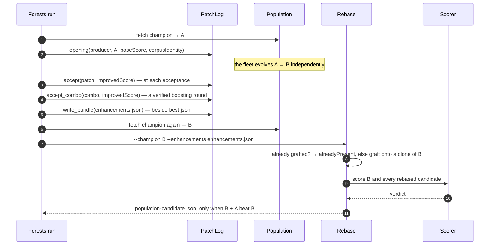

# Forests should emit enhancement bundles at acceptance

## Summary

Forests had a consumer-side graft adapter (`rebase/src/forest.rs`, Issue #2) and
a reconstruction fallback (`rebase/src/harvest.rs`), but no **producer-side**
path: an accepted patch had nowhere portable to go, so the only way back to it
was to dig it out of whatever creature it ended up in. Ockham has had that path
since Issue #8 (`PruneLog`); this is the same half for Forests.

This change adds `rebase/src/patch_log.rs`. `PatchLog` records the run's opening
facts once — the ancestor's SHA-256, its authoritative score, the corpus
identity and the creature's widths — and stamps them on every accepted patch,
which becomes a v1 `forestPatch` enhancement in acceptance order. The patch is
filed **as accepted**: the bytes are not normalised, rounded or rebuilt, so
`Patch::id()` stays the id the graft names its `forest-<id>-…` structure with,
and a champion that already carries the patch is still recognised as carrying
it. `accept_combo` files a verified boosting round as its members, in the order
the combo applies them, appending only what the run has not already filed — so
the bundle's prefix of that length reproduces the creature the combo's score was
measured on, and the single that seeded the round is not duplicated.

Filing fails closed on the graft's own preconditions, checked against the
opening creature: a non-finite score, a patch format version this build does not
implement, a non-finite weight, threshold or leaf, a bare-leaf root, an output or
feature index the ancestor does not have, a condition naming one feature twice,
and the same patch filed twice. It deliberately does *not* graft the patch to
check it — the graft happens against the fresh champion, which is a different
creature by definition, and an already-accepted patch must not be lost to a
re-derivation on the wrong one.

`write_bundle` returns `false` and writes nothing when the run accepted nothing,
which is the caller's signal not to invoke Rebase at all.

Harvesting is untouched and `--harvest-from` stays, because it is the only path
for creatures already published without a bundle — what its module docs no
longer claim is that filing does not exist yet.

Wiring NEAT-AI-Forests itself — the call at its acceptance point, behind its own
switch — remains deliberately separate, as the README has always said and as
Issue #8 did for Ockham. It is tracked as stSoftwareAU/NEAT-AI-Rebase#65, which
records the exact call site in `forests/src/run.rs` and the facts already in
scope there. It could not be filed in NEAT-AI-Forests directly: this run's `gh`
guard refused `gh issue create --repo stSoftwareAU/NEAT-AI-Forests` with
`[SECURITY] [WRITE_REPO_BLOCKED]`.

Closes #36.

## Evidence

Backend/library change with no web interface, so no screenshot applies. The
evidence is the test suite: `rebase/tests/forest_reentry.rs` drives the real CLI
over real creature JSON, a real `.bin` corpus and its computed identity, the real
engine and the real staging/emission path — only the scorer is scripted.



Full gate, clean:

```text
$ ./quality.sh < /dev/null
…
test result: ok. 132 passed; 0 failed  (unit)
test result: ok. 4 passed; 0 failed    (tests/forest_reentry.rs)
test result: ok. 7 passed; 0 failed    (tests/ockham_reentry.rs)
test result: ok. 15 passed; 0 failed   (tests/race_conditions.rs)
test result: ok. 3 passed; 0 failed    (doc-tests)
All quality checks passed!
```

Each acceptance criterion maps to a test that asserts on the artefact the
producer actually wrote, not on how it was built:

| Acceptance criterion | Test |
| --- | --- |
| Every locally accepted patch, in acceptance order, with the exact accepted payload bytes | `the_filed_bundle_carries_the_opening_facts_the_order_and_the_exact_payloads`, `patches_are_filed_as_v1_forest_patches_in_acceptance_order` |
| `Patch::id()` matches the id the graft used, so a champion carrying it is recognised | `a_patch_the_champion_already_carries_is_recognised_and_costs_nothing`, `a_filed_id_is_the_id_the_graft_uses` |
| The bundle's `corpusIdentity` matches what Rebase computes from the same corpus | `the_filed_bundle_carries_the_opening_facts_the_order_and_the_exact_payloads` |
| A run that accepts nothing writes no bundle, and the caller can skip the rebase | `a_run_that_accepted_nothing_writes_no_bundle_and_says_so`, `a_run_that_accepted_nothing_writes_no_bundle` |
| Discovery behaviour is unchanged | no discovery code exists in this repo; `PatchLog` only reads what it is handed, and every existing suite is unmodified and green |

Two details worth a reviewer's eye:

* "costs nothing" is asserted by handing that run a scorer that **errors if it
  is invoked at all**, so a run that spent a corpus pass on a patch the champion
  already carries fails the test rather than passing quietly;
* the order test files the two patches *second-then-first*, so a bundle that
  sorted by id — which is what a harvest does — would fail it.

## Test Plan

Added:

* `rebase/src/patch_log.rs` unit tests (10) — the opening facts land on every
  filed patch; acceptance order and the `forestPatch` wire form survive a JSON
  round trip; the filed id is the id the graft names its structure with; a
  duplicate patch, a combo naming one twice, an empty combo, an out-of-range
  output or feature, a repeated feature, a bare-leaf root, an unsupported patch
  version and non-finite scores or trees each fail closed with nothing partial
  filed; an empty run writes no bundle; and a filed bundle replays through the
  consumer-side engine.
* `rebase/tests/forest_reentry.rs` (4) — the end-to-end suite in the table
  above, over the real CLI.

Unchanged: no existing test was modified or removed; `ockham_reentry.rs`,
`race_conditions.rs` and every other suite still pass.

Documentation updated in the same change: `docs/integration.md` (Forests worked
example rewritten around `PatchLog`, with a sequence diagram),
`docs/enhancement-format.md` (how patches are filed and what filing refuses),
`README.md` (status), and `rebase/src/harvest.rs` (its module docs no longer say
the producer side does not exist; they now say what harvesting is still for).

## Pre-PR security self-check

* Input validation: `PatchLog::opening` / `accept` / `accept_combo` validate
  every externally supplied value — finite scores, a supported patch version, a
  finite and non-degenerate tree, output and feature indices within the opening
  creature, no repeated feature in a condition — before anything is filed.
* Secrets: none staged; the change touches source, tests and docs only.
* Injection surface: no new SQL, shell or HTTP calls. The one new filesystem
  write is `write_bundle`, to a caller-supplied path, with the error surfaced as
  `PatchLogError::Write` rather than swallowed.
* Error handling: every failure path returns a typed error naming the fault; no
  `unwrap` on caller input, and no silent fallback. A combo whose members are
  all already filed returns an empty slice with that meaning documented, not an
  empty result standing in for success.
* Dependencies: none added.
