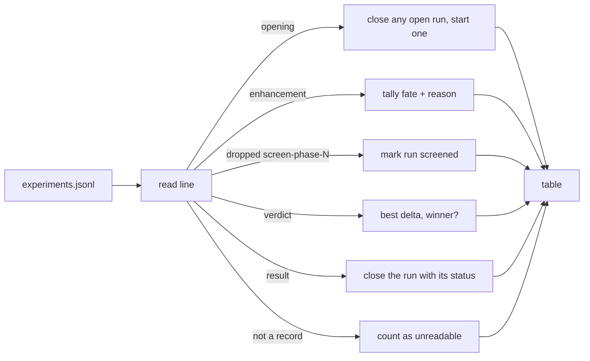

## Summary

Every rebase writes `experiments.jsonl` and nothing read it back, so the
questions that decide whether to keep the feature on were answered by
hand-written `jq`. This adds `neat_ai_rebase report <experiments.jsonl>...`,
mirroring the NEAT-AI-Forests convention: read one or many journals, print a
table, exit `0`. No new dependencies. Closes #38.

The reporter answers the five questions the issue names, and keeps the outcomes
apart rather than collapsing them:

- how many runs found an empty delta (`nothingToDo`) versus how many were
  rejected by the corpus (`noImprovement`), versus `incompatible` and `failed`
  — collapsing those is the mistake this exists to prevent;
- how many produced an authoritative win;
- the spread of the best candidate's gain over the champion (minimum, median,
  maximum);
- how often the screen killed everything, versus the full pass confirming or
  rejecting what the screen kept;
- how many enhancements were `alreadyPresent` versus `incompatible`, and for the
  incompatible ones, which reason.

Three rules shape the reader, each covered by a test:

- **A partial last line is normal.** A run killed mid-write leaves one; it is
  counted under `unreadable lines` and shown, never hidden, and never fatal.
- **Absent is not zero.** Records are read through a lenient reader whose every
  field is optional, so a field an older Rebase never wrote is left out of the
  numbers instead of counted as `0`. A verdict with no `delta` prints `no delta
  recorded`.
- **An unreadable *file* still fails loudly** — exit `1`, naming the journal.
  Only an unreadable *line* is tolerated.

Runs are segmented rather than merged: the journal is append-only and an output
directory can be reused, so a `result` record closes a run and an `opening`
starts one. A run that died before its `result` is reported as exactly that.

Two supporting changes: `journal.rs` now exports `SCREEN_PHASE_LABEL_PREFIX` so
the writer and the reader agree on the label without a duplicated string, and
`--champion`, `--training-data` and `--output-dir` became `Option<PathBuf>`
because the subcommand negates the run's required flags (`clap` still enforces
them for a rebase run; a library caller that omits one gets a named error rather
than a guess).

## Evidence

Backend CLI change — there is no web interface to screenshot. The evidence is
the command's own output and the tests.

Run against a journal of 25 runs, whose last line was truncated to simulate a
run killed mid-write:

```text
$ neat_ai_rebase report experiments.jsonl
NEAT-AI-Rebase journal report

Journals
  files read                               1
  records read                           107
  unreadable lines                         1
  runs                                    25

Runs by outcome
  improved                                 4
  noImprovement                            3
  nothingToDo                             16
  incompatible                             1
  dryRun                                   0
  failed                                   0
  no result recorded                       1

Enhancements
  alreadyPresent                          30
  applied                                  8
  incompatible                             5

Incompatible because
  corpus identity mismatch                 4
  input count 2 != 3                       1

Best candidate vs champion
  runs scored                              7
  runs with a winner                       4
  minimum                                 -1.300e-2
  median                                  +8.000e-4
  maximum                                 +2.190e-2

Screen vs the authoritative pass
  runs screened                            8
  screen kept nothing                      1
  full pass confirmed                      4
  full pass rejected                       3
  outcome not recorded                     0

$ echo $?
0
```

That is the shape GRQ #4431 needs: 16 of the 20 non-wins were empty deltas
rather than rejections, which says the fleet had already absorbed the work — the
opposite of what "25 runs, 4 wins" alone would suggest.

How a journal becomes the table:



`./quality.sh` passes: fmt, clippy `-D warnings`, 176 tests (147 unit, 26
integration, 3 doc), and `cargo doc` with `RUSTDOCFLAGS=-D warnings`.

## Test Plan

New tests in `rebase/src/report.rs`, each reading a real journal file from disk
through the real reader:

- `the_four_non_win_outcomes_are_never_collapsed` — `nothingToDo`,
  `noImprovement`, `incompatible` and `failed` are counted separately and all
  appear in the table.
- `a_partial_last_line_is_counted_not_fatal` — a truncated final record is
  counted, and the completed run before it is still read.
- `a_run_that_never_wrote_its_result_is_reported_as_such` — an opening with no
  result, followed by a complete run in the same file, reports two runs.
- `an_absent_field_reads_as_absent_rather_than_zero` — a record with no
  `claimedGain` and a candidate with no `delta` are read, and the missing delta
  stays out of the distribution instead of becoming `0.0`.
- `enhancement_fates_and_incompatible_reasons_are_counted_separately`.
- `the_delta_distribution_comes_from_the_verdicts_that_recorded_one` and
  `an_even_number_of_deltas_takes_the_midpoint`.
- `the_screens_agreement_with_the_full_pass_is_reported` and
  `a_screened_run_killed_before_scoring_is_undecided_not_a_rejection`.
- `many_journals_aggregate_into_one_table`,
  `an_unreadable_journal_fails_loudly`,
  `an_empty_journal_reports_zero_runs_rather_than_failing`.

New tests in `rebase/src/cli.rs`:

- `report_reads_the_journals_a_run_wrote` — runs the real CLI twice into one
  output directory (one improvement, one rejection), then reports the journal
  those runs wrote and checks both runs, the winner count and the enhancement
  fates; then drives the same journal through the `report` subcommand and
  asserts exit `0`.
- `report_names_the_journal_it_cannot_read` — exit `1`, message names the file.
- `report_needs_no_champion_and_a_rebase_run_still_does` — the subcommand
  negates the run's required flags, still demands a journal, and a rebase run
  still demands all of its own.

Existing tests were updated only where `Cli` is built as a struct literal
(`rebase/tests/{race_conditions,forest_reentry,ockham_reentry}.rs` and the
`cli.rs` harness) to wrap the three now-optional paths. No test was removed,
disabled or weakened.
