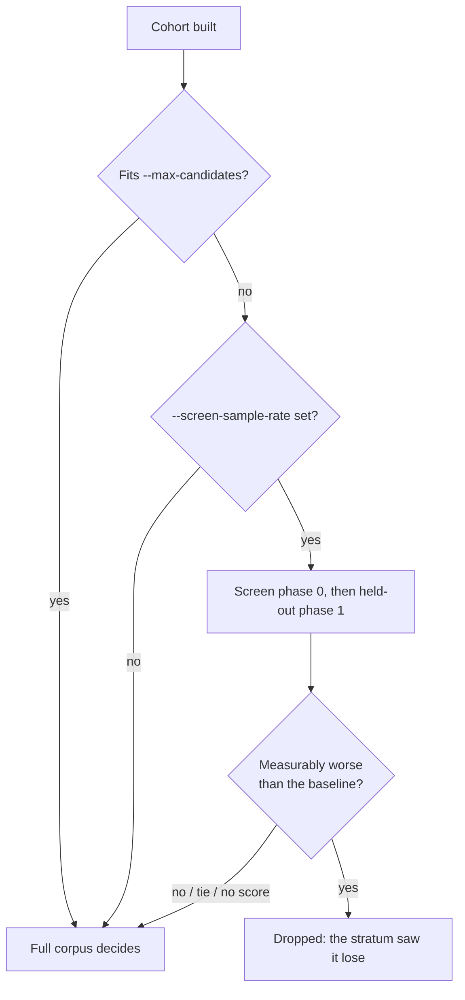

## Summary

The screen engaged whenever a bundle had more than one enhancement, and vetoed
any candidate that did not *strictly beat* the champion on a 5% stratum. On the
observed GRQ run that combination cost the run everything: three enhancements
built a cohort of six, `--max-candidates` was 8, so the whole cohort already
fitted the authoritative budget — the screen could not save a single corpus
pass, and spent an extra scorer invocation to discard all three patches.

Two changes, both in `rebase/src/cli.rs`:

* **Gate on the budget, not the count.** The screen engages only when the
  cohort built *before the cap* exceeds `--max-candidates`. An uncapped run
  (`--max-candidates 0`) has no budget to compare against, so the documented
  default (`DEFAULT_MAX_CANDIDATES = 8`) stands in for one — a 14-patch cohort
  is still screened. A skipped screen is journalled under `screen-skipped`,
  deliberately *not* prefixed `screen-phase-`, so `neat_ai_rebase report` does
  not count it among the runs whose screen agreed or disagreed with the corpus.
* **Eliminate one-sidedly.** A graft is an `IF` subtree that fires on a subset
  of records; a stratum holding none of them scores it at the baseline exactly.
  That is the stratum failing to resolve the candidate, not the candidate
  failing. `measurably_worse` now drops a candidate only when the stratum sees
  it lose by more than `--min-improvement`; a tie, a sub-resolution difference,
  and a candidate the screen returned no score for are **undecided** and go to
  the authoritative pass — which is the only thing that promotes anything.

Docs record the effect size the screen is powered for: at `r = 0.05` it
resolves gross losses of order 1e-2 to 1e-3, one to two orders of magnitude
above the fleet's own accepted-patch gain (7.1e-05) and discard margin
(5.7e-05). `rN ≳ (σ/d)²` is stated so a rate can be picked from the effect
rather than from a round number.

Closes #42.

## Evidence

Backend CLI change — no web interface to screenshot. The evidence is the test
suite: both new integration tests fail against the unfixed code and pass after
it, verified by stashing the two source files and re-running.

```text
$ git stash push rebase/src/cli.rs rebase/src/journal.rs && cargo test --test screen_budget
neat_ai_rebase: screen phase 0 kept 0 of 2
thread 'a_cohort_that_fits_the_budget_is_never_screened' panicked ...
failures:
    a_candidate_the_stratum_cannot_resolve_survives_the_screen
    a_cohort_that_fits_the_budget_is_never_screened
test result: FAILED. 1 passed; 2 failed

$ git stash pop && cargo test --test screen_budget
test result: ok. 3 passed; 0 failed
```

`./quality.sh` passes end to end (fmt, clippy with `-D warnings`, 150 unit
tests plus every integration suite, docs build), and `markdownlint-cli2` is
clean over `README.md` and `docs/`.



## Test Plan

New — `rebase/tests/screen_budget.rs`, driving the real CLI with a scorer that
answers a stratum and the corpus differently (`ByMode`), which is what makes
the perverse case reproducible:

* `a_cohort_that_fits_the_budget_is_never_screened` — the observed run. Every
  candidate ties the baseline on the stratum; the cohort fits the budget, so no
  screen phase is journalled, `report.screen.screened_runs` is 0, the whole
  cohort reaches the corpus, and the corpus publishes the winner the stratum
  could not see.
* `a_candidate_the_stratum_cannot_resolve_survives_the_screen` — with a cap the
  cohort overflows, the screen runs, the zero-delta candidate is carried
  forward, the visible loser is not, and the corpus promotes the carried one.
* `a_loss_the_stratum_can_see_is_still_screened_out` — the screen still earns
  its keep: a candidate the stratum sees losing never reaches the corpus, even
  though the corpus would have promoted it.

New unit tests — `rebase/src/cli.rs`:

* `the_budget_gate_measures_the_cohort_the_cap_hid` — the gate counts the
  candidates `dropped_for_cap` hid, so a tight cap cannot disguise the work.
* `an_uncapped_run_screens_only_a_cohort_past_the_default_budget` — two
  enhancements are not screened uncapped; five are.
* `only_a_loss_the_stratum_can_see_screens_a_candidate_out` — tie, sub-
  resolution difference, gain, and missing score are all not "worse".

Modified (business-logic change, documented): the two existing screen tests,
`screening_narrows_the_cohort_to_what_earns_its_place` and
`a_screen_that_kills_everything_publishes_nothing`, now set
`--max-candidates 2`. Their two-enhancement cohorts fit the default budget of
8, so under the new gate they would no longer screen at all — the assertions
themselves are unchanged.
