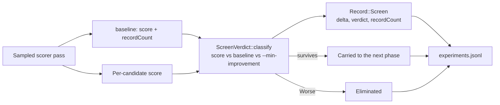

## Summary

A screen phase left only `kept 0 of 3` behind — a count that cannot tell
"these patches genuinely lose on this base" from "the stratum could not resolve
them, so each tied the baseline". Those call for opposite responses, and the
staging directory is deleted on the way out, so nothing else survives to check.

Each phase now writes a structured `screen` record to `experiments.jsonl`,
carrying per enhancement its id, producer, sampled score, **signed delta** and
verdict, and per stratum the sample rate, phase, baseline score and the record
count the stratum actually held. The same lines go to stderr at the verbosity
the count already used, with deltas in scientific notation so `-3e-4` and `0.0`
cannot round into each other.

Two smaller things follow from it:

- The screen's elimination rule moved into `ScreenVerdict::classify` /
  `survives`, replacing `measurably_worse` in `cli.rs`. The journal line and the
  decision the screen made now come from one classification, so they cannot
  disagree.
- An enhancement the engine built no candidate for is reported as `notBuilt`
  rather than vanishing from the count — it did not lose on the stratum, the
  stratum never saw it.

`neat_ai_rebase report` reads the new record **and** the `screen-phase-` dropped
string older journals hold, so a soak spanning the change keeps counting every
screened run.

Closes #43.

## Evidence

Backend/CLI change — no web interface to screenshot. The diagnostic this issue
asked for, captured from the two new integration tests
(`cargo test --test screen_budget -- --nocapture`):

A stratum that resolved nothing — every delta exactly zero, nothing eliminated:

```text
neat_ai_rebase: screen phase 0 kept 3 of 3 (baseline 0.500000 over 1000 records at rate 0.05)
neat_ai_rebase:   7b7fc3fab572a0db neat-ai-forests/test delta +0.000e0 indistinguishable
neat_ai_rebase:   f37403cf28a39df6 neat-ai-forests/test delta +0.000e0 indistinguishable
neat_ai_rebase:   dae5ed89c467d116 neat-ai-forests/test delta +0.000e0 indistinguishable
neat_ai_rebase: screen phase 1 kept 3 of 3 (baseline 0.500000 over 1000 records at rate 0.05)
```

The same survivor count with the opposite diagnosis — losses the stratum could
see:

```text
neat_ai_rebase: screen phase 0 kept 0 of 3 (baseline 0.500000 over 1000 records at rate 0.05)
neat_ai_rebase:   7b7fc3fab572a0db neat-ai-forests/test delta -3.000e-4 worse
neat_ai_rebase:   f37403cf28a39df6 neat-ai-forests/test delta -3.000e-4 worse
neat_ai_rebase:   dae5ed89c467d116 neat-ai-forests/test delta -3.000e-4 worse
```

Where the numbers come from, and where they end up:



`./quality.sh` passes: fmt, clippy with `-D warnings`, shellcheck, actionlint,
cargo-deny, the full test suite (212 tests) and `cargo doc`.
`markdownlint-cli2` is clean on the docs this PR touches.

Mutation check that the new tests are not vacuous: flipping
`ScreenVerdict::classify`'s indistinguishable arm to `Worse` fails
`journal::tests::a_screen_verdict_separates_a_seen_loss_from_a_blind_stratum`,
`cli::tests::only_a_loss_the_stratum_can_see_screens_a_candidate_out` and
`cli::tests::an_enhancement_no_candidate_was_built_for_is_journalled_not_dropped_silently`.

## Test Plan

Added:

- `rebase/tests/screen_budget.rs::a_stratum_that_resolved_nothing_journals_zero_deltas_not_a_bare_count`
  — a full CLI run whose stratum resolves nothing: both phases journal three
  zero deltas, verdict `indistinguishable`, `kept: 3`, with `recordCount` and
  `sampleRate` present.
- `rebase/tests/screen_budget.rs::a_loss_the_stratum_could_see_journals_the_signed_delta_that_killed_it`
  — the same survivor count from the opposite cause: each delta is `-3e-4` and
  each verdict `worse`.
- `rebase/src/journal.rs::a_screen_phase_journals_every_signed_delta_and_the_stratum_it_saw`
  — the record's wire shape: `recordCount`, `sampleRate`, `baselineScore` and
  per-enhancement `delta` / `verdict` / `producer`.
- `rebase/src/journal.rs::a_screen_verdict_separates_a_seen_loss_from_a_blind_stratum`
  — the classifier, including that only `Worse` and `NotBuilt` eliminate.
- `rebase/src/cli.rs::an_enhancement_no_candidate_was_built_for_is_journalled_not_dropped_silently`
  — `measure_phase` accounts for an enhancement no candidate was built for
  instead of letting it vanish from the count.
- `rebase/src/report.rs::both_screen_record_shapes_count_as_a_screened_run`
  — the reporter counts the new record and the legacy dropped string alike.

Modified (documented, not weakened):

- `rebase/src/cli.rs::only_a_loss_the_stratum_can_see_screens_a_candidate_out`
  — same five cases, now asserted through `ScreenVerdict::classify`, which
  replaced the `measurably_worse` helper it called. Each case additionally
  names *which* undecided verdict it is.
- `rebase/tests/screen_budget.rs` — the two assertions that matched the
  `screen-phase-` label now parse the journal and match the `screen` record
  that replaced it.
