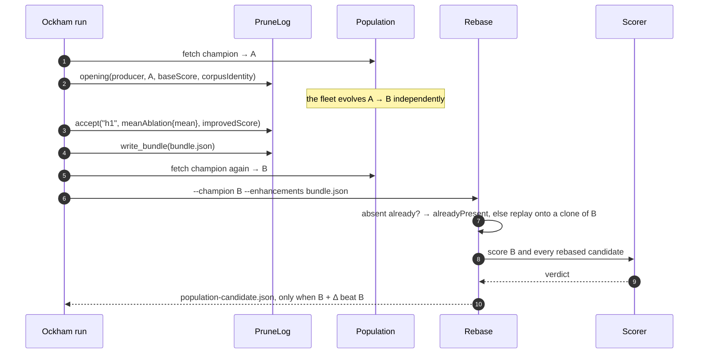

# Fix the unparseable Mermaid sequenceDiagram in pr-summary-8.md

## Summary

The carried-over quality-gate finding was a single unparseable Mermaid diagram:
`docs/archive/pr-summaries/pr-summary-8.md` line 56 carried a `;` inside a
sequence-diagram message, which Mermaid treats as a statement separator, so the
whole `sequenceDiagram` block failed to parse and rendered as an error box on
GitHub.

`;` is replaced with `,`, matching the wording the same diagram already uses in
`docs/integration.md:` (`alreadyPresent, else replay onto a clone of B`). The
diagram's meaning is unchanged; nothing else in the archived summary is touched.

I also swept every fenced ` ```mermaid ` block in the repository
(`docs/integration.md`, `docs/archive/pr-summaries/pr-summary-8.md`,
`docs/archive/pr-summaries/pr-summary-13.md`) for the same defect — this was the
only occurrence.

Closes #46.

## Evidence

Documentation-only change with no web interface, and no browser was reachable
in this run to screenshot the rendered diagram: the Playwright MCP browser tools
were not exposed to the session, and `mermaid-cli`'s own fallback died with
`Failed to launch the browser process: Code: 2 … chrome-headless-shell: 1:
Syntax error: ")" unexpected` (the installer fetched an x86-64 shell onto this
arm64 host).

Instead the diagram was fed through Mermaid 11's real parser under jsdom —
the same parse the quality gate performs — both before and after the fix:

```text
before.mmd: PARSE FAILED — Parse error on line 15:
  ...? → alreadyPresent; else replay onto a c
  -----------------------^
  Expecting 'SPACE', 'NEWLINE', … 'ACTOR', got 'else'
after.mmd:  PARSE OK
```

The corrected diagram as it now stands in `pr-summary-8.md`:



`./quality.sh` passes end to end on this checkout (shellcheck, `cargo fmt`,
`cargo clippy -D warnings`, `cargo test --workspace --all-features`,
`cargo doc`).

## Test Plan

- No Rust code changed, so no new automated test applies — the repository's gate
  covers Rust only and has no Markdown or Mermaid check to extend.
- Mermaid parse verified out of band with Mermaid 11 under jsdom: the pre-fix
  text fails on line 15 with `got 'else'`, the committed text parses cleanly
  (output quoted above). The scratch harness lived in `/tmp` and was removed.
- `./quality.sh < /dev/null` — all checks passed.
