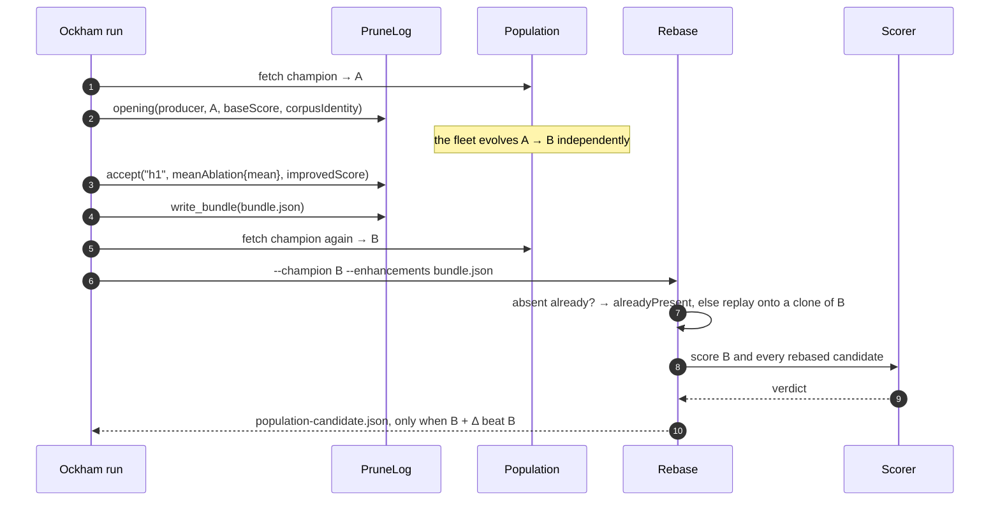

# Fix the unparseable Mermaid sequenceDiagram in pr-summary-8.md

## Summary

The carried-over quality-gate finding was a single unparseable Mermaid diagram:
`docs/archive/pr-summaries/pr-summary-8.md` line 56 carried a `;` inside a
sequence-diagram message, which Mermaid treats as a statement separator, so the
whole `sequenceDiagram` block failed to parse and rendered as an error box on
GitHub.

`;` is replaced with `,`, matching the wording the same diagram already uses in
`docs/integration.md:` (`alreadyPresent, else replay onto a clone of B`). The
diagram's meaning is unchanged; nothing else in the archived summary is touched.

I also swept every fenced ` ```mermaid ` block in the repository
(`docs/integration.md`, `docs/archive/pr-summaries/pr-summary-8.md`,
`docs/archive/pr-summaries/pr-summary-13.md`) for the same defect — this was the
only occurrence.

Closes #46.

## Evidence

Documentation-only change with no web interface. No browser was reachable in
this run to screenshot the rendered diagram: no Playwright MCP browser tool was
exposed to the session (`browser_navigate` / `browser_take_screenshot` are not
callable here), the container has no Chromium on disk
(`~/.cache/ms-playwright` does not exist, and `chromium`/`google-chrome` are not
on `PATH`), and a previous attempt at `mermaid-cli`'s own fallback died with
`Failed to launch the browser process: Code: 2 … chrome-headless-shell: 1:
Syntax error: ")" unexpected` (the installer fetched an x86-64 shell onto this
arm64 host).

The substantive evidence is the parse itself: every fenced ` ```mermaid ` block
in the repository was fed through Mermaid 11's real parser (`mermaid.parse`
under jsdom) — the same parse the diagram gate performs. Before the fix:

```text
$ node check.mjs before-8.md          # docs/archive/pr-summaries/pr-summary-8.md @ origin/Develop
FAIL  before-8.md:41 (block 1) — Parse error on line 15:
...? → alreadyPresent; else replay onto a c
-----------------------^
Expecting 'SPACE', 'NEWLINE', … 'ACTOR', got 'else'
```

After the fix, all four blocks in the repository parse:

```text
$ node check.mjs docs/archive/pr-summaries/pr-summary-8.md \
      docs/archive/pr-summaries/pr-summary-13.md \
      docs/archive/pr-summaries/pr-summary-46.md \
      docs/integration.md README.md
OK    docs/archive/pr-summaries/pr-summary-8.md:41 (block 1)
OK    docs/archive/pr-summaries/pr-summary-13.md:14 (block 1)
OK    docs/archive/pr-summaries/pr-summary-46.md:44 (block 1)
OK    docs/integration.md:113 (block 1)
none  README.md
```

The corrected diagram as it now stands in `pr-summary-8.md`:



`./quality.sh` passes end to end on this checkout (shellcheck, `cargo fmt`,
`cargo clippy -D warnings`, `cargo test --workspace --all-features`,
`cargo doc`).

## Test Plan

- No Rust code changed, so no new automated test applies — the repository's gate
  covers Rust only and has no Markdown or Mermaid check to extend.
- Mermaid parse verified out of band with Mermaid 11 under jsdom, as a
  before/after pair: the `origin/Develop` text of `pr-summary-8.md` fails on
  line 15 with `got 'else'`, the committed text parses cleanly, and the sweep
  covers every ` ```mermaid ` block in the repository (output quoted above). The
  scratch harness lived in `/tmp` and was removed.
- `./quality.sh < /dev/null` — all checks passed.
