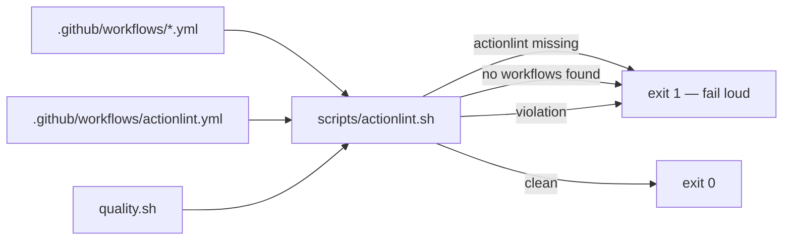

## Summary

No gate in this repository read the GitHub Actions workflows, so an invalid
`${{ }}` expression, an undefined context property, a bad `runs-on` label or a
shell bug inside a `run:` block only surfaced when a job silently stopped
gating. This PR adds `actionlint` as a CI lint gate. Closes #56.

Three pieces, deliberately small:

* `scripts/actionlint.sh` — the gate itself. With no arguments it lints every
  workflow the repository commits; explicit paths lint anything else (the tests
  use that). A missing `actionlint` **fails** with install instructions, and an
  empty target list fails too, so the gate can never report "nothing to check"
  as success.
* `.github/workflows/actionlint.yml` — runs that script on every PR and on
  pushes to `Develop`. The linter is downloaded from its release page and
  checksum-verified before it is unpacked, mirroring the gitleaks CLI fallback
  already in `gitleaks.yml`: no new third-party action is trusted, and a
  tampered release cannot execute here. `rhysd/actionlint@v1` (suggested in the
  issue) was not used — the repository publishes no `action.yml`, so that
  reference does not resolve.
* `quality.sh` — invokes the same script, so a workflow regression fails
  locally before it reaches CI. `quality.sh` documents itself as mirroring
  `ci.yml`; running one shared script is what keeps that true.

The branch filter is `["*", "milestone/*"]`, matching `gitleaks.yml`,
`semgrep.yml` and `markdown-lint.yml`: a workflow glob `*` stops at a `/`, so
without the explicit entry the milestone sub-issue PRs would merge unlinted
(the trap Issues #59–#63 fixed for the other gates).

## Evidence

Backend/CI change — no web interface to screenshot. Evidence is the test run
and the linter's own output.



The gate is green on the committed tree:

```text
$ ./scripts/actionlint.sh; echo "exit=$?"
exit=0
```

`./quality.sh` passes end to end, including the new
`Linting GitHub Actions workflows...` step:

```text
All quality checks passed!
```

The new tests, run before the implementation existed, failed for the right
reasons (`No such file or directory` for `scripts/actionlint.sh` and
`.github/workflows/actionlint.yml`; `quality.sh does not invoke
./scripts/actionlint.sh`) and pass after:

```text
running 5 tests
test quality_gate_invokes_the_shared_gate_script ... ok
test ci_invokes_the_shared_gate_script ... ok
test gate_fails_loudly_when_actionlint_is_missing ... ok
test a_broken_workflow_fails_the_gate ... ok
test committed_workflows_lint_clean ... ok

test result: ok. 5 passed; 0 failed
```

## Test Plan

Added `rebase/tests/actionlint_gate.rs` — every check drives the real script as
a subprocess:

* `gate_fails_loudly_when_actionlint_is_missing` — runs the script with a
  `PATH` holding only `env` and `bash`, and asserts a non-zero exit naming the
  missing tool. This is the silent-failure case: a gate that skips when its
  linter is absent gates nothing.
* `a_broken_workflow_fails_the_gate` — writes a workflow referencing an
  undefined `github` context property, and asserts the gate rejects it and
  names the offending expression. Regression case for the exact class of typo
  the issue is about.
* `committed_workflows_lint_clean` — the repository's own workflows pass.
* `ci_invokes_the_shared_gate_script` / `quality_gate_invokes_the_shared_gate_script`
  — both callers invoke the one script, so CI and the local gate cannot drift.

The two `actionlint_installed()`-guarded checks skip with a printed reason when
the linter is absent; CI installs it, so they run there.

Added to `rebase/tests/workflow_branch_filters.rs`, alongside the identical
pair each other workflow already has:

* `actionlint_gates_milestone_pull_requests`
* `actionlint_still_gates_unnested_branches`

Docs: `CONTRIBUTING.md` lists `actionlint` among the tools `quality.sh` needs
and describes the new workflow, including how to install the linter.
