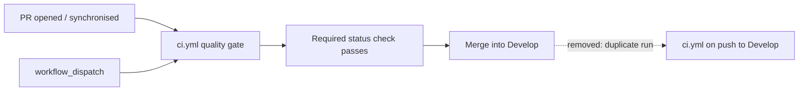

# CI gates the pull request, not the merge commit (Issue #57)

## Summary

`.github/workflows/ci.yml` is a test/lint gate, but it also triggered on
`push:` to `Develop`. As a required status check it already gates every merge
on the PR, so the push run was a duplicate of a run that had just passed — it
burns CI minutes and can leave a red tick on the default branch for a check
that already went green. Dropped the `push:` block; `pull_request` (into
`Develop` and `milestone/*`) and `workflow_dispatch` are unchanged, so nothing
loses coverage and the gate can still be re-run by hand on the default branch.

Deploy/publish workflows are deliberately left alone — they must keep firing on
push. This change touches only `ci.yml`.

Closes #57.

## Evidence

Backend/CI-only change; there is no web interface to screenshot. The evidence
is the trigger set of the committed workflow, asserted by tests that read the
file.



Test run before the fix — the new assertion reproduces the finding:

```text
ci.yml triggers ["pull_request", "push", "workflow_dispatch"] still include
`push` — the gate would re-run on every merge into the default branch,
duplicating the PR run
```

After the fix, `./quality.sh` passes end to end (fmt, clippy `-D warnings`,
`cargo test --workspace --all-features`, cargo-deny, shellcheck, actionlint,
doc build), and `./scripts/actionlint.sh` exits 0 on the edited workflow.

## Test Plan

- Added `rebase/tests/workflow_push_triggers.rs`:
  - `ci_does_not_rerun_on_push_to_the_default_branch` — regression test; reads
    the committed `.github/workflows/ci.yml` and fails while a `push:` trigger
    is present (verified failing before the fix, passing after).
  - `ci_still_gates_pull_requests_and_stays_dispatchable` — the removal did not
    take `pull_request` or `workflow_dispatch` with it.
  - `on_triggers_reads_nested_keys_only` and `on_triggers_sees_a_push_trigger`
    — cover the `on:` block reader itself (nested keys only, comments and
    sequence items skipped, block ends at the next top-level key), so the
    assertions above cannot pass vacuously.
- Existing `rebase/tests/workflow_branch_filters.rs` still passes, including
  `ci_gates_milestone_pull_requests` and `ci_still_gates_develop` — the
  `pull_request` filter is untouched.
- Updated `CONTRIBUTING.md` to record why `ci.yml` has no `push:` trigger and
  how to re-run it on the default branch.
