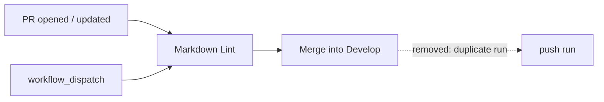

# Markdown Lint gates the PR, not the merge commit

## Summary

`.github/workflows/markdown-lint.yml` triggered on both `pull_request` and
`push:` to `Develop`. As a required status check the PR run already gates every
merge, so the push run was a duplicate: wasted CI minutes, and a check that can
redden the default branch after it has already gone green on the PR.

Dropped the `push:` trigger. `pull_request` (with the `["*", "milestone/*"]`
filter Issue #62 added) and `workflow_dispatch` are unchanged, so every PR —
including the sub-issue PRs into `milestone/<slug>` — is still linted, and a
fresh run on `Develop` is one dispatch away. This is the same fix `ci.yml`
took for Issue #57; the comment left in place of the trigger points at the test
that holds it.

Closes #58.

## Evidence

Backend/CI change with no web interface to screenshot — the evidence is the
test run plus the committed trigger set.



`cargo test --test workflow_push_triggers` before the workflow edit — the new
assertion reproduces the finding:

```text
markdown_lint_does_not_rerun_on_push_to_the_default_branch ... FAILED
markdown-lint.yml triggers ["pull_request", "push", "workflow_dispatch"] still
include `push` — the gate would re-run on every merge into the default branch,
duplicating the PR run
```

After the edit, and the full gate:

```text
test result: ok. 6 passed; 0 failed  (workflow_push_triggers)
test result: ok. 13 passed; 0 failed (workflow_branch_filters)
./quality.sh — All quality checks passed!
markdownlint-cli2 v0.23.2 — Summary: 0 issues in 0 files
```

## Test Plan

Added to `rebase/tests/workflow_push_triggers.rs`, alongside the Issue #57
tests it reuses the `on:` parser from:

- `markdown_lint_does_not_rerun_on_push_to_the_default_branch` — reads the
  committed workflow and asserts `push` is absent from its trigger set. Fails
  against the unfixed workflow (output above), passes after.
- `markdown_lint_still_gates_pull_requests_and_stays_dispatchable` — asserts
  `pull_request` and `workflow_dispatch` survive, so the fix cannot be "passed"
  by deleting the whole `on:` block.

No existing test was modified or removed. `rebase/tests/workflow_branch_filters.rs`
still asserts the `milestone/*` PR filter for this workflow and passes unchanged.

Docs: the `markdown-lint.yml` bullet in `CONTRIBUTING.md` now records the
missing `push:` trigger and points at `workflow_dispatch`, matching the wording
already used for `ci.yml`.
