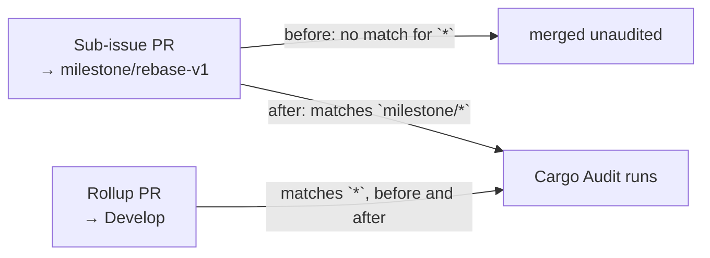

# Cargo Audit now gates milestone PRs

## Summary

`.github/workflows/cargo-audit.yml` filtered pull requests with
`branches: ["*"]`. A GitHub workflow branch glob `*` stops at a `/`, so the
filter matched `Develop` but never `milestone/<slug>` — the shared branch that
milestone sub-issue PRs target. Every sub-issue PR therefore merged into the
milestone branch without the security audit running; the gap only surfaced when
the single rollup PR reached the default branch.

The filter is now `branches: ["*", "milestone/*"]`, so the audit runs on
milestone PRs as they merge while continuing to gate every unnested base
branch. `CONTRIBUTING.md` records that "every PR" includes milestone sub-issue
PRs and why the extra glob is needed. Closes #59.

Scope note: `ci.yml`, `gitleaks.yml`, `markdown-lint.yml` and `semgrep.yml`
carry the same `["*"]` filter, each already tracked by its own issue
(#60, #61, #62, #63). They are deliberately untouched here; the matcher and
YAML-filter helpers added in `rebase/tests/workflow_branch_filters.rs` are
reusable when those land.

## Evidence

Backend/CI-configuration change — no web interface to screenshot. The evidence
is the regression test, which models GitHub's own glob rules rather than
grepping the workflow for a string.

Against the unfixed workflow (filter temporarily reverted to `["*"]`):

```text
thread 'cargo_audit_gates_milestone_pull_requests' panicked at
rebase/tests/workflow_branch_filters.rs:109:9:
cargo-audit.yml filter ["*"] does not gate PRs into milestone/rebase-v1

test result: FAILED. 2 passed; 1 failed
```

With the fix in place:

```text
running 3 tests
test single_star_does_not_cross_a_slash ... ok
test cargo_audit_gates_milestone_pull_requests ... ok
test cargo_audit_still_gates_unnested_branches ... ok

test result: ok. 3 passed; 0 failed
```

`./quality.sh` passes end to end (`All quality checks passed!`), and
`npx markdownlint-cli2@0.23.2 CONTRIBUTING.md` reports 0 issues.

Which PRs the gate fires on, before and after:



## Test Plan

Added `rebase/tests/workflow_branch_filters.rs`:

- `single_star_does_not_cross_a_slash` — pins the matcher to GitHub's rules:
  `*` matches `Develop` but not `milestone/rebase-v1`, `milestone/*` matches a
  single segment only, `**` crosses slashes, and literals do not match by
  prefix.
- `cargo_audit_gates_milestone_pull_requests` — the committed filter matches
  `milestone/rebase-v1` and `milestone/producer-wiring`. This is the regression
  test: it fails against the unfixed `["*"]` filter, as shown above.
- `cargo_audit_still_gates_unnested_branches` — the filter still matches
  `Develop`, `main` and an issue branch, so the fix adds coverage rather than
  narrowing it.

The YAML reader panics when no `pull_request` `branches:` key is present, so a
filter deleted outright fails loudly instead of passing vacuously on an empty
list.
