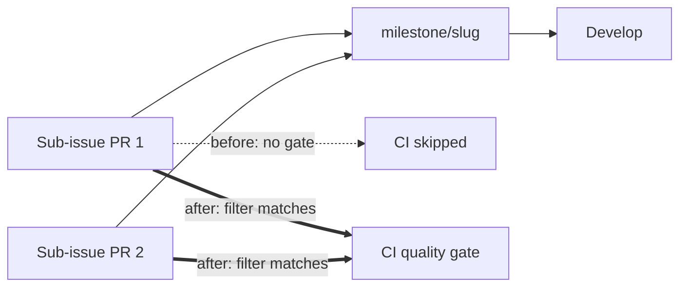

# Gate milestone PRs in the CI quality workflow (Issue #60)

## Summary

`.github/workflows/ci.yml` filtered `pull_request` on `branches: [Develop]`
only, so the repository's main quality gate — `cargo deny`, `cargo fmt`,
clippy, the workspace build, the test run, the doc build and the shell checks —
never fired on the sub-issue PRs that target a shared `milestone/<slug>`
branch. Those PRs merged into the milestone branch completely ungated, and the
gap only surfaced later on the single rollup PR into `Develop`.

Adds `milestone/*` to the `pull_request` branch filter, so the gate runs on
milestone sub-issue PRs as they merge. `milestone/<slug>` has no nested
slashes, so the single-level glob is sufficient — a workflow glob `*` stops at
a `/`, which is exactly why the existing filter never matched. The `push`
filter is untouched: pushes to milestone branches arrive via the gated PRs.

This is the third and last of the same finding in this repo — `cargo-audit.yml`
(Issue #59) and `markdown-lint.yml` (Issue #62) were fixed the same way, and
this change reuses their test harness.

Closes #60.

## Evidence

Backend/CI-configuration change — no web interface to screenshot. Evidence is
the test run plus `actionlint`.



`cargo test -p neat-ai-rebase --test workflow_branch_filters` before the
workflow change (the new test fails against the unfixed filter):

```text
test ci_gates_milestone_pull_requests ... FAILED
ci.yml filter ["Develop"] does not gate PRs into milestone/rebase-v1
test result: FAILED. 6 passed; 1 failed
```

After:

```text
running 7 tests
test ci_gates_milestone_pull_requests ... ok
test ci_still_gates_develop ... ok
...
test result: ok. 7 passed; 0 failed
```

`actionlint .github/workflows/ci.yml` exits 0, and `./quality.sh` passes end to
end.

## Test Plan

- Added `ci_gates_milestone_pull_requests` in
  `rebase/tests/workflow_branch_filters.rs` — reads the committed `ci.yml`,
  parses its `pull_request` branch filter, and asserts it matches
  `milestone/rebase-v1` and `milestone/producer-wiring` under GitHub's own glob
  rules. This is the regression test: it fails against the unfixed filter.
- Added `ci_still_gates_develop` — asserts the change did not drop the existing
  `Develop` coverage.
- The pre-existing `single_star_does_not_cross_a_slash`,
  `cargo_audit_*` and `markdown_lint_*` tests are unmodified and still pass.
- Updated `CONTRIBUTING.md` to record that `ci.yml` gates `milestone/*` PRs and
  why the glob has to be listed explicitly.
