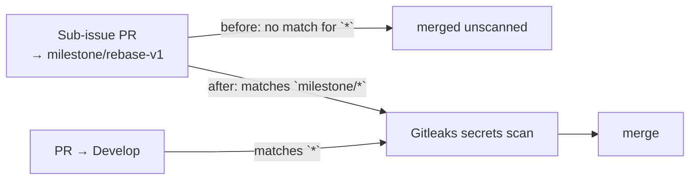

# Gitleaks gates milestone sub-issue PRs

## Summary

`.github/workflows/gitleaks.yml` filtered pull requests with `branches: ["*"]`.
A GitHub workflow branch glob `*` stops at a `/`, so that pattern matched
`Develop` and `issue-<n>-…` but never `milestone/<slug>` — the shared branch
every milestone sub-issue PR targets. Secrets scanning therefore never ran on
those PRs, and a committed credential would only surface later, on the single
rollup PR into the default branch.

The filter now reads `branches: ["*", "milestone/*"]`, matching the fix already
applied to `ci.yml`, `cargo-audit.yml` and `markdown-lint.yml` (Issues #59,
#60, #62). `CONTRIBUTING.md` records the same coverage note it already carries
for the sibling gates. Closes #61.

## Evidence

Backend/CI-configuration change — no web interface to screenshot. The evidence
is the test suite: `rebase/tests/workflow_branch_filters.rs` models GitHub's
own filter-glob rules and asserts them against the committed workflow file, so
the assertion fails if the YAML regresses.

Before the fix:

```text
---- gitleaks_gates_milestone_pull_requests stdout ----
gitleaks.yml filter ["*"] does not gate PRs into milestone/rebase-v1
test result: FAILED. 1 passed; 1 failed
```

After the fix:

```text
running 9 tests
test gitleaks_gates_milestone_pull_requests ... ok
test gitleaks_still_gates_unnested_branches ... ok
...
test result: ok. 9 passed; 0 failed
```

Which PRs the gate covers, before and after:



## Test Plan

- Added `gitleaks_gates_milestone_pull_requests` to
  `rebase/tests/workflow_branch_filters.rs` — asserts the committed filter
  matches `milestone/rebase-v1` and `milestone/producer-wiring`. Fails against
  the unfixed workflow (output above), passes after.
- Added `gitleaks_still_gates_unnested_branches` — asserts `Develop`, `main`
  and `issue-61-fix` are still gated, so the fix cannot narrow coverage.
- `./quality.sh` passes in full.
