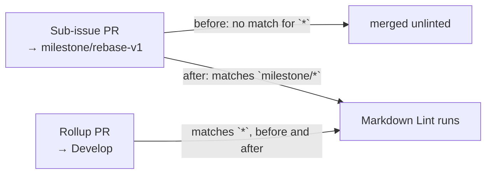

# Markdown Lint now gates milestone PRs

## Summary

`.github/workflows/markdown-lint.yml` filtered pull requests with
`branches: ["*"]`. A GitHub workflow branch glob `*` stops at a `/`, so the
filter matched `Develop` but never `milestone/<slug>` — the shared branch that
milestone sub-issue PRs target. Every sub-issue PR therefore merged into the
milestone branch unlinted, and the gap only surfaced when the single rollup PR
reached the default branch.

The filter is now `branches: ["*", "milestone/*"]`, so `markdownlint-cli2` runs
on milestone PRs as they merge while continuing to gate every unnested base
branch. `CONTRIBUTING.md` records that "every PR" includes milestone sub-issue
PRs and why the extra glob is needed. Closes #62.

This reuses the matcher and YAML-filter helpers added for #59; the only
refactor is `cargo_audit_filter()` becoming `workflow_filter(file)` so both
workflows share one reader. `ci.yml`, `gitleaks.yml` and `semgrep.yml` carry
the same `["*"]` filter under their own issues (#60, #61, #63) and are
deliberately untouched.

## Evidence

Backend/CI-configuration change — no web interface to screenshot. The evidence
is the regression test, which models GitHub's own glob rules rather than
grepping the workflow for a string.

Against the unfixed workflow:

```text
thread 'markdown_lint_gates_milestone_pull_requests' panicked at
rebase/tests/workflow_branch_filters.rs:132:9:
markdown-lint.yml filter ["*"] does not gate PRs into milestone/rebase-v1

test result: FAILED. 4 passed; 1 failed
```

With the fix in place:

```text
running 5 tests
test single_star_does_not_cross_a_slash ... ok
test cargo_audit_gates_milestone_pull_requests ... ok
test cargo_audit_still_gates_unnested_branches ... ok
test markdown_lint_gates_milestone_pull_requests ... ok
test markdown_lint_still_gates_unnested_branches ... ok

test result: ok. 5 passed; 0 failed
```

`./quality.sh` passes end to end (`All quality checks passed!`).

Which PRs the gate fires on, before and after:



## Test Plan

`rebase/tests/workflow_branch_filters.rs`:

- `markdown_lint_gates_milestone_pull_requests` — the committed filter matches
  `milestone/rebase-v1` and `milestone/producer-wiring`. This is the regression
  test: it fails against the unfixed `["*"]` filter, as shown above.
- `markdown_lint_still_gates_unnested_branches` — the filter still matches
  `Develop`, `main` and an issue branch, so the fix adds coverage rather than
  narrowing it.
- The existing `single_star_does_not_cross_a_slash` and the two `cargo_audit_*`
  tests still pass against the shared `workflow_filter(file)` reader.

That reader panics when no `pull_request` `branches:` key is present, so a
filter deleted outright fails loudly instead of passing vacuously.
