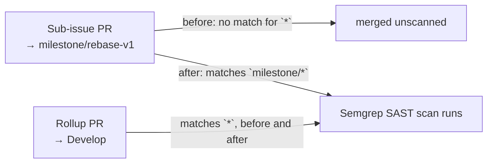

# Semgrep now gates milestone PRs

## Summary

`.github/workflows/semgrep.yml` filtered pull requests with `branches: ["*"]`.
A GitHub workflow branch glob `*` stops at a `/`, so the filter matched
`Develop` but never `milestone/<slug>` — the shared branch that milestone
sub-issue PRs target. Every sub-issue PR therefore merged into the milestone
branch with no static-analysis scan, and the gap only surfaced when the single
rollup PR reached the default branch.

The filter is now `branches: ["*", "milestone/*"]`, so `semgrep ci` runs on
milestone PRs as they merge while continuing to gate every unnested base
branch. `CONTRIBUTING.md` records that the Semgrep gate covers milestone
sub-issue PRs and why the extra glob is needed. Closes #63.

This reuses the matcher and YAML-filter helpers added for #59; no refactor was
needed. `dependency-review.yml` still carries a `["*"]` filter and is
deliberately untouched — it is outside this issue's scope.

## Evidence

CI-configuration change — no web interface to screenshot. The evidence is the
regression test, which models GitHub's own glob rules rather than grepping the
workflow for a string.

Against the unfixed workflow:

```text
thread 'semgrep_gates_milestone_pull_requests' panicked at
rebase/tests/workflow_branch_filters.rs:196:9:
semgrep.yml filter ["*"] does not gate PRs into milestone/rebase-v1

test result: FAILED. 10 passed; 1 failed
```

With the fix in place:

```text
running 11 tests
test semgrep_gates_milestone_pull_requests ... ok
test semgrep_still_gates_unnested_branches ... ok
test single_star_does_not_cross_a_slash ... ok
test cargo_audit_gates_milestone_pull_requests ... ok
test cargo_audit_still_gates_unnested_branches ... ok
test ci_gates_milestone_pull_requests ... ok
test ci_still_gates_develop ... ok
test gitleaks_gates_milestone_pull_requests ... ok
test gitleaks_still_gates_unnested_branches ... ok
test markdown_lint_gates_milestone_pull_requests ... ok
test markdown_lint_still_gates_unnested_branches ... ok

test result: ok. 11 passed; 0 failed
```

`./quality.sh` passes end to end (`All quality checks passed!`), and
`npx markdownlint-cli2@0.23.2` reports `0 issues`.

Which PRs the gate fires on, before and after:



## Test Plan

`rebase/tests/workflow_branch_filters.rs`:

- `semgrep_gates_milestone_pull_requests` — the committed filter matches
  `milestone/rebase-v1` and `milestone/producer-wiring`. This is the regression
  test: it fails against the unfixed `["*"]` filter, as shown above.
- `semgrep_still_gates_unnested_branches` — the filter still matches `Develop`,
  `main` and an issue branch, so the fix adds coverage rather than narrowing
  it.
- The nine existing tests (the glob model plus the `cargo_audit_*`, `ci_*`,
  `gitleaks_*` and `markdown_lint_*` pairs) still pass unchanged.

The shared `workflow_filter(file)` reader panics when no `pull_request`
`branches:` key is present, so a filter deleted outright fails loudly instead
of passing vacuously.
