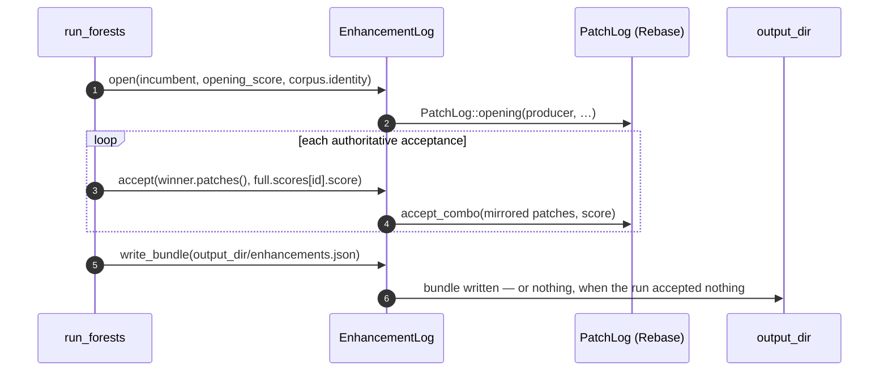

# Forests call site: invoke PatchLog at acceptance and file the bundle beside best.json

## Summary

Issue #36 landed the producer-side contract on this side —
`neat_ai_rebase::patch_log::PatchLog` records the opening creature's checksum,
authoritative score, corpus identity and widths once and stamps them on every
accepted Forest patch or verified combo — but nothing called it. The call site
lives in `stSoftwareAU/NEAT-AI-Forests`, so the code half of this issue is a
**cross-repo PR** against that repository; what changes here is the
documentation that claimed the call did not exist yet.

**In NEAT-AI-Forests** (branch `issue-65-file-enhancements-at-acceptance`), a new
`forests/src/enhancements.rs` wraps `PatchLog` in the switch
`docs/integration.md` step 6 asks for:

* `EnhancementLog::open(...)` once, on the creature the run opened on and the
  score `establish_baseline` just established — the facts every filed patch is
  stamped with;
* `accept(winner.patches(), full.scores[id].score)` in the single
  `match (&outcome.winner, &outcome.full)` arm where a patch or combo is
  authoritatively accepted, filing the members in the order the winner applies
  them and appending only what the run has not already filed;
* `write_bundle(output_dir/enhancements.json)` at the end, which writes nothing
  when the run accepted nothing — the signal not to invoke Rebase at all.

Patches cross to Rebase by a JSON round trip between the two mirrored formats,
guarded by an id check: the bytes carry unchanged, provenance included, so
`Patch::id()` stays the id the graft names its `forest-<id>-…` structure with.
The switch is `--enhancements`, off by default, and filing failures are loud —
a patch Rebase refuses poisons the bundle, so no file is written and the run
fails at the end rather than emitting a bundle whose prefixes claim scores they
do not reproduce. Forests gains a sibling path dependency on this crate and the
`.github/actions/setup-neat-ai-rebase` checkout-and-symlink step its CI needs,
mirroring `setup-neat-core`.

**In this repository**, `README.md` and `docs/integration.md` no longer say the
Forests call is still to come: they name where it lives, which switch it is
behind, and the test that proves the switch is inert. Ockham's own call site is
still outstanding, and is stated as such.

Closes #65.

## Evidence

Backend/CLI change with no web interface, so no screenshot applies. The
evidence is the Forests test suite, run against this checkout of Rebase as the
path dependency.



```text
test enhancements::tests::translation_preserves_the_patch_id_and_its_provenance ... ok
test enhancements::tests::a_switched_off_log_records_nothing_and_writes_nothing ... ok
test enhancements::tests::a_run_that_accepted_nothing_writes_no_bundle ... ok
test enhancements::tests::a_refused_patch_poisons_the_bundle_instead_of_shortening_it ... ok
test enhancements::tests::accepted_patches_are_filed_in_order_and_never_twice ... ok
test enhancements::tests::a_non_finite_baseline_is_refused_at_open ... ok
test run::tests::with_enhancements_off_nothing_is_written_and_the_run_is_unchanged ... ok
test run::tests::accepted_patches_are_filed_and_the_bundle_rebases_onto_a_champion_the_run_never_saw ... ok

test result: ok. 132 passed; 0 failed  (neat_ai_forests lib)
```

The end-to-end test drives the real loop over a real corpus, then reads the
bundle back and checks it against the journal's own account of what was
accepted: the same patch ids, in acceptance order, each stamped with the
opening creature's checksum, the opening score and the corpus identity. It then
rebases the bundle onto a champion the run never produced and asserts every
enhancement applies — the case the whole mechanism exists for.

`--enhancements` as the binary reports it:

```text
      --enhancements
          File every accepted patch as a Rebase enhancement bundle
          (`enhancements.json`, beside `best.json`), so re-entry grafts the
          run's discoveries onto a freshly fetched champion instead of
          publishing this run's own descendant. Off by default; it changes how
          a run publishes, never what it accepts
```

Both repositories' quality gates were run in the foreground. Forests: shellcheck,
actionlint, markdownlint, `cargo deny`, `cargo fmt --check`, clippy with
`-D warnings`, the full test suite and `cargo doc` all pass; only `codespell`
was skipped, because no `pip` exists in this container to install it (CI runs
it for real).

## Test Plan

New, in NEAT-AI-Forests:

- `forests/src/enhancements.rs` unit tests — id and provenance survive the
  translation to Rebase's mirrored format; a switched-off log records and writes
  nothing; acceptance order is the bundle order and a combo never re-files a
  member; a run that accepted nothing writes no bundle; a patch Rebase refuses
  poisons the bundle instead of shortening it; a non-finite baseline is refused
  at open.
- `run::tests::accepted_patches_are_filed_and_the_bundle_rebases_onto_a_champion_the_run_never_saw`
  — end to end over the loop: the bundle matches the journal's accepted patches
  in order, carries the opening creature's facts, and rebases onto an unrelated
  champion with every enhancement applied.
- `run::tests::with_enhancements_off_nothing_is_written_and_the_run_is_unchanged`
  — the same run with the switch on and off produces the same candidates, the
  same acceptances, the same score and the same final checksum, and writes no
  bundle when off.

Unchanged and still passing: the whole existing Forests suite (132 lib tests
plus the README/docs contract, auto-version, real-scorer and TS-parity
integration tests) and this repository's own suite.
