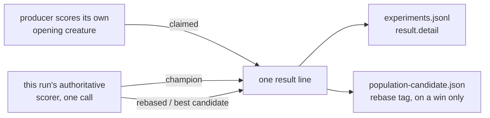

# Name every rebase delta's baseline: claimed, champion, rebased

## Summary

A rebase result line could report a loss against the producer's claim and a gain
against the champion in one breath, without saying that the two deltas came from
different baselines — which reads as the creature having got worse when the
rebase actually helped. The score vocabulary now lives in a focused
`rebase/src/message.rs`:

- `SourceScore::Claimed` / `SourceScore::Validated` keeps a producer's own
  figure apart from one this run's authoritative scorer measured, and each
  renders in its own words (`claim delta … vs claimed X` /
  `source delta … vs validated source X`).
- The rebase's own gain is always written `champion X → rebased Y (+Δ)`, so the
  arrow carries its baseline.
- A run that promotes nothing gets a message too, in the same vocabulary, rather
  than the silence it had before.
- Both lines are journalled on the `result` record, so an unattended reader
  finds what a run decided without reconstructing it from the verdict.

Nothing about the numbers changed — only which baseline each one is said to have
come from. Closes #80.

## Evidence

Backend/CLI change with no web interface, so the evidence is the tests and the
strings themselves. The two lines a run now writes:

```text
🪢 Rebase applied · 2 enhancements from neat-ai-forests · champion 0.419407 → rebased 0.419751 (+3.44e-4) · claim delta -1.50e-3 vs claimed 0.421251
🪢 Rebase not applied · 2 enhancements from neat-ai-forests · champion 0.500000 held · best candidate 0.490000 (-1.00e-2) · claim delta -1.10e-1 vs claimed 0.600000
```

against what the first replaced:

```text
🪢 Rebase · 2 enhancements from neat-ai-forests · score: 0.419751 (+3.44e-4 vs champion, -2.29e-6 vs source)
```

Where each number comes from, and where it is written:



`./quality.sh` passes end to end: fmt, clippy `-D warnings`, 224 tests across
the workspace (157 unit, 7 new integration, the rest pre-existing), 5 doctests,
and the `-D warnings` doc build.

## Acceptance Criteria

<!-- vibe-spec-review inputs="diff+issue-body" -->

- **met** — Rebase output clearly distinguishes candidate/validated score from
  final rebased score — evidence: `rebase/src/message.rs::rebase_message`
  (`champion {:.6} → rebased {:.6}`), asserted by
  `rebase/tests/result_messages.rs::a_promoted_candidate_is_journalled_and_tagged_with_the_same_message`
  — reviewer: met — reason: the reviewer noted the production path always
  names the baseline `champion` rather than the issue's word `validated`; both
  the champion and the rebased score come from the same authoritative call, so
  labelling only one of them "validated" would have implied the other was not.
  `SourceScore::Validated` carries that word where it genuinely applies — a
  source creature this run scored itself, as `rebase_experiment` does.
- **met** — a discrepancy from the producer's claimed score is described as a
  validation/claim delta, not as the creature having declined — evidence:
  `rebase/src/message.rs::SourceScore::against`, guarded by the banned-word
  check in `rebase/tests/result_messages.rs::assert_reads_cleanly` applied to
  every message under test — reviewer: met
- **met** — positive rebase delta shown explicitly as `candidate → rebased` —
  evidence:
  `rebase/tests/result_messages.rs::a_positive_rebase_delta_is_shown_as_champion_to_rebased`
  — reviewer: met
- **partial** — the message stays concise enough for commit subjects/logs —
  evidence: `rebase/tests/result_messages.rs::assert_reads_cleanly` bounds every
  message at 180 characters — reviewer: partial — reason: the applied line is
  147 characters and the hold line 163, against 107 for the line it replaced;
  naming three absolute scores and two baselines costs length, and the budget
  is a bound rather than a reduction.
- **met** — wording stays generic, with no GRQ- or market-specific terminology
  in the public library — evidence: `rebase/src/message.rs` names only
  producer, champion, candidate and corpus concepts — reviewer: met
- **met** — test: validation lower than claimed, rebase still improves the
  candidate — evidence:
  `rebase/tests/result_messages.rs::a_validation_below_the_claim_is_a_claim_delta_not_a_decline`
  (the issue's own numbers) — reviewer: met
- **met** — test: validation higher than claimed — evidence:
  `rebase/tests/result_messages.rs::a_validation_above_the_claim_is_reported_against_the_claim_too`
  — reviewer: partial — reason: the reviewer was right that the first fixture
  put the validated champion *below* the claim and only the rebased score above
  it; the fixture now scores the champion 0.5 against a 0.45 claim, so the
  validated baseline itself is above the claim.
- **met** — test: rebase applied with a positive delta — evidence:
  `rebase/tests/result_messages.rs::a_positive_rebase_delta_is_shown_as_champion_to_rebased`
  and the end-to-end
  `a_promoted_candidate_is_journalled_and_tagged_with_the_same_message` —
  reviewer: met
- **met** — test: rebase attempted but produces no improvement — evidence:
  `rebase/tests/result_messages.rs::an_unpromoted_run_journals_why_the_champion_held`
  runs the CLI and asserts the journalled `result.detail` — reviewer: met
- **unrequested** — the `message` module, with `RebaseStamp` and
  `rebase_message` moved out of `tags` — reviewer: unrequested — reason: a
  no-improvement message is not a creature tag, and the issue's vocabulary is
  now one thing with one home; `tags` imports it privately, so there is a
  single public path.
- **unrequested** — `SourceScore::Validated` as a fourth term beyond the
  issue's three stages — reviewer: unrequested — reason: `rebase_experiment`
  really does score the source creature authoritatively, so calling its number
  a claim would have been the exact mislabelling this issue is about.
- **unrequested** — the result message is journalled on the `result` record,
  and `finish` gained a `detail` parameter — reviewer: unrequested — reason:
  without it the no-improvement message would be library code no run emits, and
  the fourth test bullet would have nothing end-to-end to assert.
- **unrequested** — `attempted` is the de-duplicated union of the cohort's
  applied ids — reviewer: unrequested — reason: it is the count the hold line
  needs (how many enhancements reached the authoritative pass); nothing else in
  the run carries it.
- **unrequested** — `best_score: None` renders "no candidate scored" —
  reviewer: unrequested — reason: kept deliberately. `no_improvement_message`
  is public API, not a CLI-only helper, and the repo's "absent is not zero"
  rule forbids reporting a `0.000000` best candidate nobody measured.
- **unrequested** — the hold line names `--min-improvement` when the best
  candidate beat the champion and still lost — reviewer: unrequested — reason:
  found by review, not in the issue text, but it is the same defect: "held"
  beside `+1.00e-3` is two numbers whose relationship a reader must guess.
- **unrequested** — the README and `docs/rebase-protocol.md` sections —
  reviewer: unrequested — reason: the change renames the vocabulary consumers
  read, which owes a docs change.

## Standards Review

<!-- vibe-standards-review inputs="diff+CODING-STANDARDS.md" -->

The repo has no `CODING-STANDARDS.md`; the reviewer was given the diff,
`CONTRIBUTING.md`, `quality.sh` and the fleet-wide standards.

- **violation** — a code change owes a docs change: "Every run writes one line
  describing its outcome" was false for `nothingToDo`, `incompatible` and
  `dryRun` — evidence: `README.md` "What a run says it did" — reason: fixed
  here; both the README and `docs/rebase-protocol.md` now say the line comes
  from runs that reached the scorer, and name the outcomes that write none.
- **violation** — stale doc comment on a repurposed field: `Record::Result`'s
  `detail` was documented as failure-only while now carrying the success
  message — evidence: `rebase/src/journal.rs:212` — reason: fixed here.
- **violation** — a comment naming a vocabulary the code does not produce: the
  union example passed `SourceScore::Validated` under a comment about the claim
  delta — evidence: `rebase/examples/union_experiment.rs:524` — reason: fixed
  here.
- **violation** — KISS / one home for a symbol: `tags` re-exported
  `RebaseStamp` and `rebase_message` but not `SourceScore`, so the compat path
  could not construct a stamp — evidence: `rebase/src/tags.rs:30` — reason:
  fixed here by dropping the re-export. `neat_ai_rebase::tags::RebaseStamp` is
  a **breaking change** for downstream consumers, who must import from
  `neat_ai_rebase::message`; they have to touch the call site anyway, because
  `source_score` changed from `f64` to `SourceScore`.
- **violation** — no unused public API: `SourceScore::value()` existed only for
  its own test — evidence: `rebase/src/message.rs` — reason: fixed here,
  removed with its test.
- **violation** — an unexplained `filter_map(… .ok())` over journal lines in
  the new test — evidence: `rebase/tests/result_messages.rs:265` — reason:
  fixed here with a comment; the following `expect` still fails loudly when no
  readable `result` record was written.
- **clean** — Australian English throughout the added prose and comments; the
  full gate (fmt, clippy `-D warnings`, tests, doctests, doc build,
  markdownlint) passing unmodified; tests calling real functions and asserting
  on returned strings, journal file contents and exit codes with no
  source-text grepping and no wall-clock assertions; happy-path, error-path and
  edge coverage for both new public functions; "absent is not zero" respected;
  `{:+.2e}` sign handling with a regression test that `+-` can never be
  printed; no hidden or credential-shaped files staged; no dependency or
  workflow changes.

One reviewer note was left as-is rather than fixed: `RebaseStamp::label` is
carried but never printed. It is pre-existing, outside this issue's scope, and
removing a public field would break consumers for no gain here.

## Test Plan

Added `rebase/tests/result_messages.rs` — 7 tests:

- `a_validation_below_the_claim_is_a_claim_delta_not_a_decline` — the issue's
  own numbers; asserts the arrow, the claim delta and the absence of "declined".
- `a_validation_above_the_claim_is_reported_against_the_claim_too` — the
  validated champion above the claim, same wording, opposite sign.
- `a_positive_rebase_delta_is_shown_as_champion_to_rebased`.
- `an_attempted_rebase_that_wins_nothing_names_the_champion_that_held`.
- `a_verdict_with_no_candidate_scored_says_so_rather_than_inventing_one`.
- `a_promoted_candidate_is_journalled_and_tagged_with_the_same_message` — runs
  the CLI over a scripted scorer and asserts the journal `result.detail` equals
  the emitted creature's `rebase` tag.
- `an_unpromoted_run_journals_why_the_champion_held` — the same, for a hold.

Every message in that file also passes a shared guard asserting it uses no
"decline" wording and fits the commit-subject budget.

Added in `rebase/src/message.rs` — 5 unit tests plus 2 doctests: the 🪢 prefix
on both messages, every delta naming its baseline, a claim delta below the
claim never printing `+-`, a validated source never being called a claim, the
threshold named when a positive delta still lost, and singular/plural agreement.

Modified: `rebase/src/tags.rs::stamping_updates_score_and_error_in_place_and_appends_rebase`
now expects the new wording. Three tests that pinned the old format string
(`the_rebase_tag_uses_the_knot_emoji`, `the_message_names_both_comparisons`,
`a_candidate_below_the_source_reads_as_a_loss_against_it`) moved to
`rebase/src/message.rs` with the module they cover, as
`both_messages_keep_the_knot_emoji`,
`every_delta_names_the_baseline_it_was_taken_from` and
`a_candidate_below_the_claim_is_a_signed_claim_delta` — same assertions in the
new vocabulary, none dropped.
