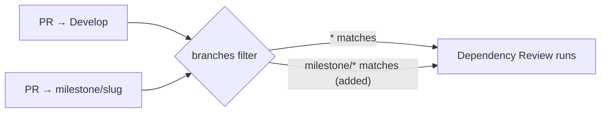

# Dependency Review gates `milestone/*` pull requests

## Summary

`.github/workflows/dependency-review.yml` filtered its `pull_request` trigger on
`branches: ["*"]`. A workflow branch glob `*` stops at a `/`, so it matched
`Develop` but never `milestone/<slug>` — the shared branch milestone sub-issue
PRs target. Every sibling gate in this repository (`ci.yml`, `actionlint.yml`,
`cargo-audit.yml`, `gitleaks.yml`, `semgrep.yml`, `markdown-lint.yml`) already
lists `milestone/*` explicitly; dependency review was the one that was missed,
so those PRs merged with no dependency-vulnerability gate at all and the gap
only surfaced when the rollup PR reached `Develop`.

The filter is now `branches: ["*", "milestone/*"]`, matching the sibling
workflows, and the change is held by two tests in the existing
`rebase/tests/workflow_branch_filters.rs` harness. The `dependency-review`
bullet in `CONTRIBUTING.md` gains the same milestone sentence its five sibling
bullets already carry.

Closes #84.

## Evidence

Backend/CI change — no web interface to screenshot. The behaviour is verified by
tests that read the committed workflow file and match its filter against real
branch names using a model of GitHub's own glob rules (`*` stops at `/`, `**`
does not).

Red before the fix:

```text
running 2 tests
test dependency_review_gates_milestone_pull_requests ... FAILED
test dependency_review_still_gates_unnested_branches ... ok

dependency-review.yml filter ["*"] does not gate PRs into milestone/rebase-v1
```

Green after the fix:

```text
running 15 tests
...
test dependency_review_gates_milestone_pull_requests ... ok
test dependency_review_still_gates_unnested_branches ... ok

test result: ok. 15 passed; 0 failed; 0 ignored; 0 measured; 0 filtered out
```

`./quality.sh` — full gate, run after the final edit: `All quality checks
passed!` (includes `actionlint` over the edited workflow).

Which PRs the gate now sees:



## Test Plan

- Added `rebase/tests/workflow_branch_filters.rs::dependency_review_gates_milestone_pull_requests`
  — asserts the committed filter matches `milestone/rebase-v1` and
  `milestone/producer-wiring`. Observed failing against the unfixed workflow.
- Added `rebase/tests/workflow_branch_filters.rs::dependency_review_still_gates_unnested_branches`
  — asserts `Develop`, `main` and `issue-84-fix` are still gated, so the fix
  cannot narrow coverage.
- Whole file re-run: 15 tests pass, including the pre-existing sibling-workflow
  assertions.
