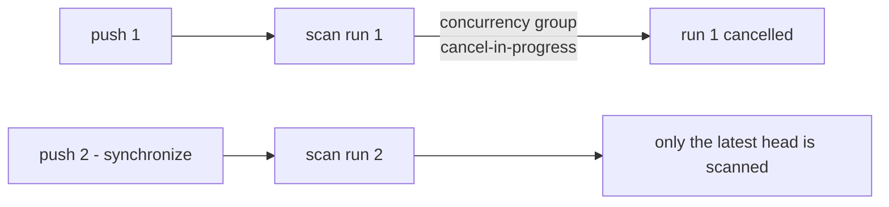

## Summary

`dependency-review.yml`, `gitleaks.yml` and `semgrep.yml` trigger on
`pull_request` but declared no `concurrency:` block, so every `synchronize`
push left the superseded run executing to completion — CI minutes burnt on the
20-minute Semgrep container scan and the full-history Gitleaks fetch, and a
stale result racing the latest push. Each now carries the same
`group: <workflow>-<github.ref>` / `cancel-in-progress: true` pattern already
used by `actionlint.yml`, `cargo-audit.yml`, `ci.yml` and `markdown-lint.yml`.
Closes #85.

`cargo-upgrade.yml` is deliberately untouched: it is schedule-triggered, not
PR-triggered, and its ungrouped `cancel-in-progress: false` exists so a run is
never killed between pushing the upgrade branch and opening the PR.

## Evidence

Backend/CI-only change — no web interface to screenshot. The evidence is the
new test suite, which reads the committed workflow YAML and was observed
failing before the fix:

```text
test every_pull_request_workflow_cancels_superseded_runs ... FAILED
  dependency-review.yml triggers on `pull_request` but declares no
  `concurrency:` block — a superseded run keeps burning CI minutes after the
  next push
test the_scan_workflows_from_issue_85_are_covered ... FAILED
```

After the change, `cargo test --test workflow_concurrency` reports
`6 passed; 0 failed`, and the full `./quality.sh` gate (shellcheck, actionlint,
cargo-deny, fmt, clippy, tests, doc build) ends with
`All quality checks passed!`. `markdownlint-cli2@0.23.2` over `CONTRIBUTING.md`
reports `0 issues`.



## Test Plan

Added `rebase/tests/workflow_concurrency.rs`:

- `concurrency_reads_the_group_and_cancel_keys`,
  `concurrency_is_absent_when_the_block_is_not_declared`,
  `concurrency_reads_a_block_that_does_not_cancel` — parser unit tests,
  including the comment-in-block and no-cancel (`cargo-upgrade.yml`) shapes.
- `triggers_on_pull_request_ignores_comments_and_other_triggers` — the trigger
  detector reads keys nested under `on:`, not prose.
- `every_pull_request_workflow_cancels_superseded_runs` — sweeps every
  committed workflow and requires a ref-keyed group with
  `cancel-in-progress: true` on each one that triggers on `pull_request`, so a
  future gate cannot be added without the guard.
- `the_scan_workflows_from_issue_85_are_covered` — names the three workflows
  from the issue so the sweep can never pass vacuously.

Docs: `CONTRIBUTING.md` now records the invariant and names the test that
holds it.
