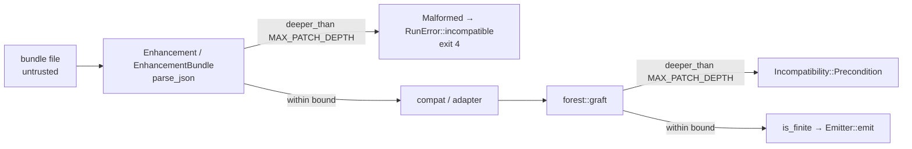

# Bound patch tree depth on the forward path

## Summary

`Node` is a recursive tree, and every walk over it — `evaluate`, `is_finite`,
`depth`, `split_count`, `collect_features`, and the graft's `Emitter::emit` —
descends one stack frame per level. The only depth bound in the codebase,
`harvest`'s, guards the *reverse* direction: reconstructing a patch out of a
creature that already carries it. Nothing bounded the **forward** path, where an
untrusted `--enhancements` bundle is parsed and applied, so a deeply nested
`split` chain would exhaust the process stack rather than fail closed with a
reason the way every other malformed-patch case here does.

The fix is the one the issue suggests: a single constant,
`patch::MAX_PATCH_DEPTH = 16` (the number `harvest` already used; a production
Forest tree is depth 3), enforced

* at the **parse boundary** — `Enhancement::parse_json` and
  `EnhancementBundle::parse_json`, which is what `cli::load_one` funnels every
  bundle, single enhancement and directory member through — returning
  `EnhancementError::Malformed`, which the CLI surfaces as
  `RunError::incompatible` (exit 4); and
* in **`forest::graft`**, before `is_finite` or the emitter walks the tree, so a
  patch that reaches the graft from anywhere other than a parsed bundle is
  bounded too, returning `Incompatibility::Precondition`.

The guard itself, `Node::deeper_than(limit)`, stops descending as soon as the
answer is known, so it recurses at most `limit + 1` frames — it is safe to run
on the very input it rejects. `harvest::MAX_DEPTH` is now defined as
`MAX_PATCH_DEPTH`, so both directions share one constant.

Closes #90.

## Evidence

Backend/CLI change with no web interface, so there is no screenshot to capture.
The evidence is the test run below.



`./quality.sh` passed in full after the final edit — fmt, clippy `-D warnings`,
the whole workspace test suite, and `cargo doc`. `markdownlint-cli2` reports 0
issues on the two changed docs.

```text
running 7 tests
test a_tree_at_the_bound_parses ... ok
test cli_refuses_a_bundle_whose_patch_tree_is_too_deep ... ok
test the_graft_refuses_a_tree_past_the_bound ... ok
test a_directory_member_is_bounded_as_well ... ok
test both_parsers_refuse_a_tree_past_the_bound ... ok
test a_pathologically_nested_document_fails_closed ... ok
test cli_accepts_a_bundle_at_the_depth_bound ... ok
```

### Regression test and its red/green linkage

Added
`rebase/tests/patch_depth_limit.rs::cli_refuses_a_bundle_whose_patch_tree_is_too_deep`,
which reproduces the flaw over the real CLI — it writes a bundle whose
`payload.patch.root` nests past the bound and calls `run_with`. It **fails
against the unfixed code and passes after the fix**: with the four `rebase/src`
changes stashed, the same assertions (run as a scratch copy with the bound
inlined, since `MAX_PATCH_DEPTH` does not exist on the unfixed code) showed both
halves of the trigger going through — `Enhancement::parse_json` and
`EnhancementBundle::parse_json` returned `Ok`, and `forest::apply` returned
`Applied { … 17 IF neurons … }` for a 17-level tree. With the fix restored all
seven tests pass.

### Original trigger closed, no trivial bypass

The trigger is a bundle (or single enhancement, or directory member) whose
`payload.patch.root` is a deep `Split` chain. Every route from a file to a
`Node` walk now passes a depth bound before any recursive walk runs:

* `cli::load_one` has exactly two readers, `Enhancement::parse_json` and
  `EnhancementBundle::parse_json`, and both call `check_patch_depth` on every
  enhancement before returning — a directory just loops over `load_one`, so it
  inherits the same bound (`a_directory_member_is_bounded_as_well`).
* The other forward entry, `--harvest-from`, was already bounded by
  `harvest::build`, which now shares the same constant.
* `forest::graft` re-checks before `is_finite` and `emit`, so an in-process
  patch that never went through a parser cannot bypass the parse-side check.
* The generic `serde_json::Value` parse in `load_one`/`check_version` is bounded
  by serde_json's own 128-container recursion limit, which returns an `Err`
  rather than recursing without limit. `a_pathologically_nested_document_fails_closed`
  pins that: a 100,000-level document returns `EnhancementError::Malformed`
  instead of aborting the process.
* `deeper_than` is itself depth-limited, so the guard cannot be the thing that
  overflows.

Depth is a property of the tree, not of its encoding, so there is no equivalent
input (whitespace, key order, wide-versus-deep shape) that reaches a recursive
walk with more than 16 levels.

## Test Plan

- Added `rebase/tests/patch_depth_limit.rs` — 7 integration tests: the CLI
  refusal end to end, a bundle at the bound still applied, both parsers refusing
  a tree past the bound, a tree at the bound parsing, the graft's own refusal, a
  100k-level document failing closed, and a directory member bounded the same
  way.
- Added `rebase/src/patch.rs::depth_bound_is_exact_on_both_sides` — the unit
  test for `Node::deeper_than`: leaf, stump, both sides of the bound, and that
  depth is the maximum over both branches.
- No existing test was modified or removed; the full workspace suite passes.
