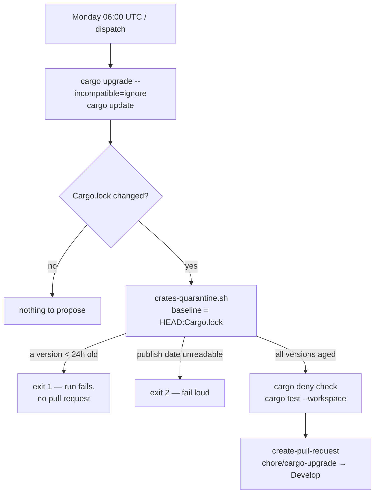

# Quarantine freshly published crates.io versions in the weekly Cargo bump

## Summary

`.github/workflows/cargo-upgrade.yml` is this repository's only dependency
update mechanism, and it resolved whatever crates.io offered at run time.
`cargo deny check` judges licences and known advisories, the suite judges
behaviour — neither judges **recency**, so a version published minutes ago by a
compromised publishing account could be proposed for merge before crates.io or
RustSec had a chance to flag it.

This adds `scripts/crates-quarantine.sh`, a publish-age gate wired into the
workflow between the bump and the pull request. It reads the `created_at` of
every crates.io version the bump newly resolved and fails the run when one has
been public for less than 24 hours. Fetch failures and unparseable timestamps
exit 2 — an unreachable crates.io is never reconciled as "outside the window".
Internal `stSoftwareAU` crates are exempt via `--exempt`; none are consumed from
crates.io today, since `neat-core` is a `path` dependency.

Closes #91.

## Evidence

Backend/CI change with no web interface to screenshot. The evidence is the test
suite, the gate's behaviour against the live crates.io API, and the workflow
diff.

### Where the gate sits



### Regression test linkage

`rebase/tests/crates_quarantine_gate.rs::the_upgrade_workflow_runs_the_quarantine_gate_before_opening_the_pull_request`
reproduces the flaw: it **fails against the unfixed code** — observed as
`cargo-upgrade.yml must run scripts/crates-quarantine.sh over the refreshed
lockfile` before the workflow was wired up — and **passes after the fix**, and
it asserts the gate runs *before* `peter-evans/create-pull-request`, not after.
`rebase/tests/crates_quarantine_gate.rs::a_version_published_inside_the_window_fails_the_gate`
drives the real script over a lockfile whose `serde` moved to a version
published two hours before a fixed `--now`, and asserts exit 1 with the crate
named.

### Original trigger closed, no trivial bypass

The trigger was the scheduled `cargo upgrade`/`cargo update` resolving a
newly-published version. That path now runs the gate on every changed lockfile
(`if: steps.changes.outputs.changed == 'true'` — the only branch that reaches
the PR step at all), and the gate judges **every** `registry+` package in the
refreshed `Cargo.lock` that is not byte-identical in the pre-bump baseline, so a
fresh version cannot reach `create-pull-request` by arriving as a transitive
dependency, a new dependency, or a re-resolved one. The three ways a gate like
this is usually bypassed are closed explicitly: a missing publish date exits 2
rather than passing, an unparseable or non-UTC `created_at` exits 2, and a
future-dated stamp yields a negative age and quarantines. Crate names and
versions are matched against `^[A-Za-z0-9_-]+$` / `^[A-Za-z0-9_.+-]+$` before
they reach the request URL, so a tampered lockfile cannot redirect the query.

### Gate output against the live API

```console
$ ./scripts/crates-quarantine.sh --lockfile /tmp/live.lock --hours 24
OK         serde 1.0.100 published 61317h ago
OK   1 newly resolved crates.io version(s) are all older than 24h
```

### Full quality gate

```console
$ ./quality.sh < /dev/null
...
Running tests...
test result: ok. 10 passed; 0 failed  (crates_quarantine_gate)
...
All quality checks passed!
```

`./scripts/actionlint.sh` also passes over the edited workflow.

## Test Plan

Added `rebase/tests/crates_quarantine_gate.rs` — ten checks, each driving the
real script or reading the committed workflow:

- `a_version_published_inside_the_window_fails_the_gate` — a version two hours
  old exits 1 and is named.
- `a_version_older_than_the_window_passes_the_gate` — a five-day-old version
  exits 0.
- `only_versions_the_bump_moved_are_judged` — an unchanged crate is not queried
  (no stub exists for it, so a query would fail the run).
- `every_registry_version_is_judged_without_a_baseline` — with no baseline both
  crates are judged and the fresh one still fails.
- `an_unreadable_publish_date_fails_loudly_rather_than_passing` — a failed fetch
  exits 2.
- `a_malformed_created_at_fails_loudly_rather_than_passing` — an unparseable
  stamp exits 2.
- `an_exempt_crate_skips_the_window` — `--exempt 'stsoftware-*'` skips the
  window and reports the exemption.
- `path_dependencies_carry_no_publish_date_and_are_not_queried` — a path-only
  lockfile passes without touching the network.
- `a_non_utc_now_is_rejected` — `--now` without a UTC designator is a usage
  error.
- `the_upgrade_workflow_runs_the_quarantine_gate_before_opening_the_pull_request`
  — the committed workflow runs the gate, with a baseline lockfile, ahead of
  the pull-request step.

Timestamps are fixed via `--now` and publish dates are served from a stub
`file://` API, so the suite is deterministic and offline.
