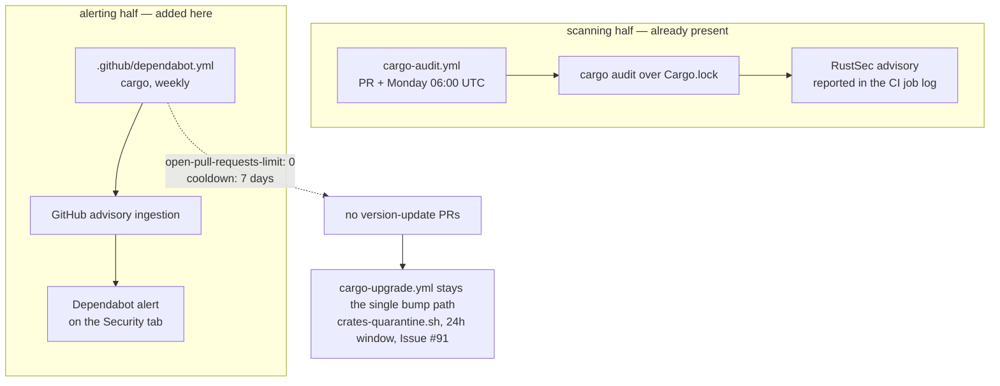

# Commit a Dependabot configuration alongside the cargo-audit scanner

## Summary

`.github/workflows/cargo-audit.yml` audits the committed `Cargo.lock` against
the RustSec advisory database on every pull request and every Monday — the
scanning half of `SCR-VULN-SCAN`. Dependabot's advisory feed is the other half:
an independent channel, fed by GitHub's own ingestion, that a maintainer sees on
the repository's Security tab rather than only in a CI job log. No
`.github/dependabot.yml` was committed anywhere, so nothing in the tree said
that channel was wired up.

This adds `.github/dependabot.yml` registering the `cargo` ecosystem on the same
weekly 06:00 UTC Monday slot the two Cargo workflows already share.

It deliberately sets `open-pull-requests-limit: 0`. `cargo-upgrade.yml` is this
repository's single dependency-bump path *because* it is the one that runs
`scripts/crates-quarantine.sh` and refuses any crates.io version published in
the last 24 hours (Issue #91). A second weekly bumper with no publish-age window
would propose exactly the fresh release that gate exists to hold back, so
version-update pull requests stay where the quarantine is. It also sets
`cooldown.default-days: 7`, Dependabot's own publish-age window, so a freshly
published version is held for a week even if that limit is later raised — the
guard no longer depends on the limit alone. Dependabot security
updates are a separate repository switch and are not governed by that limit, so
disabling version updates does not disable the alerting this file is committed
for.

Closes #93.

## Evidence

Backend/CI configuration change with no web interface to screenshot. The
evidence is the test suite, the full local gate, and the config diff.

### The two halves of SCR-VULN-SCAN



### Test linkage

`rebase/tests/dependabot_config.rs` was written first and observed failing
against the unfixed tree — three of its four tests panicked with
`.github/dependabot.yml must be committed: No such file or directory (os error
2)` — then passed once the configuration landed:

```text
running 5 tests
test a_configuration_without_a_cargo_entry_is_rejected ... ok
test cargo_updates_wait_out_a_publish_age_cooldown ... ok
test the_repository_commits_a_dependabot_configuration ... ok
test cargo_version_update_pull_requests_stay_with_the_quarantined_workflow ... ok
test dependabot_watches_the_cargo_ecosystem_weekly ... ok

test result: ok. 5 passed; 0 failed
```

`cargo_updates_wait_out_a_publish_age_cooldown` was added in response to the
review's `dependabot-missing-cooldown` finding and observed failing before the
`cooldown` block landed.

The tests parse the committed YAML into dotted key paths rather than grepping
it, so `schedule.interval` cannot be satisfied by an `interval:` that happens to
sit somewhere else in the entry.

### Quality gate

`./quality.sh` was run in full after the final edit and reported
`All quality checks passed!` — bash syntax, shellcheck, actionlint,
`cargo deny check`, `cargo fmt --check`, clippy with `-D warnings`,
`cargo test --workspace --all-features`, and the doc build.
`npx markdownlint-cli2@0.23.2` reports 0 issues over the changed Markdown.

## Test Plan

- Added `rebase/tests/dependabot_config.rs`:
  - `the_repository_commits_a_dependabot_configuration` — the file exists and
    declares schema `version: 2`.
  - `dependabot_watches_the_cargo_ecosystem_weekly` — a `cargo` entry at
    `directory: "/"` with `schedule.interval: "weekly"`.
  - `cargo_version_update_pull_requests_stay_with_the_quarantined_workflow` —
    `open-pull-requests-limit: 0`, so the quarantined workflow keeps the bump
    path to itself.
  - `cargo_updates_wait_out_a_publish_age_cooldown` — `cooldown.default-days`
    parses as a whole number and is at least 7.
  - `a_configuration_without_a_cargo_entry_is_rejected` — the error path: a
    configuration registering only `github-actions` yields no cargo entry, and
    nested keys stay dotted rather than collapsing.
- No existing test was modified or removed.
