# Route a failed security job to a human

## Summary

`.github/workflows/cargo-audit.yml` runs unattended at 06:00 UTC every Monday —
no pull request, no author, nobody watching. When an advisory lands against an
already-locked dependency that run goes red and the only trace is the Actions
tab, which no one is guaranteed to open. None of the three `SCR-SEC-ALERTING`
readiness paths closed that gap: the PR-triggered security jobs at least block a
merge, but nothing routed a scheduled failure anywhere, and `SECURITY.md`
covered inbound vulnerability *reporting* only, with no documented triage owner.

This closes two of the three paths:

* **Failure routing.** A `notify` job, guarded by `if: failure() &&
  github.event_name != 'pull_request'` and `needs: audit`, opens an issue titled
  *"cargo audit failed on the scheduled run"* — or comments on the one already
  open, so a persistent advisory does not file a fresh issue every Monday.
  `pull_request` failures are deliberately excluded: those already block the
  merge in front of the author, and an issue per red PR would train maintainers
  to ignore the channel.
* **Documented escalation.** `SECURITY.md` gains an *Internal escalation*
  section naming the triage owner (`@stSoftwareAU/developers`, the CODEOWNERS
  default), what the scheduled audit failure opens, the response it expects, and
  why the PR-triggered gates need no notification of their own.

Least privilege is preserved. The `audit` job keeps `contents: read`; `issues:
write` is scoped to the `notify` job, which never checks the repository out.
Every workflow value reaches the script through `env:` rather than being
interpolated into it, so nothing GitHub supplies can be read as shell, and
`set -euo pipefail` makes a failed `gh` call fail the job loudly — a
notification that dies quietly is worse than none.

The third path, an advisory-notification config, is already committed as
`.github/dependabot.yml` (Issue #93) and is untouched here.

Closes #94.

## Evidence

Backend/CI configuration change with no web interface to screenshot. The
evidence is the test suite, `actionlint`, and the full local gate.

### Where a red security job goes

```mermaid
flowchart TD
    subgraph pr["pull_request run — already routed"]
        A[cargo audit fails on a PR] --> B[required check goes red]
        B --> C[merge blocked in front of the author]
    end
    subgraph sched["scheduled run — routed here"]
        D[Monday 06:00 UTC<br/>cargo audit fails] --> E{notify job<br/>failure&#40;&#41; and not a PR}
        E -->|no open triage issue| F[gh issue create<br/>maintainer notified]
        E -->|one already open| G[gh issue comment<br/>no weekly duplicate]
    end
    F --> H[SECURITY.md — Internal escalation<br/>owner: @stSoftwareAU/developers]
    G --> H
```



### Test run

```text
$ cargo test --test security_alerting
running 5 tests
test a_workflow_whose_only_job_can_fail_unnoticed_is_rejected ... ok
test a_failed_cargo_audit_is_routed_to_a_notification_job ... ok
test security_policy_documents_who_triages_a_failed_security_job ... ok
test only_the_notification_job_may_write_and_it_writes_issues_alone ... ok
test the_notification_opens_or_updates_a_github_issue ... ok
test result: ok. 5 passed; 0 failed
```

All four assertions failed against the unmodified workflow and policy before the
change landed — the parser's negative test was the only one green. `./quality.sh`
passes end to end, including `actionlint` over the edited workflow (an earlier
draft was rejected with `SC2016` for a Markdown code span in single quotes; the
issue body is plain prose now).

## Test Plan

New suite `rebase/tests/security_alerting.rs`, which parses the committed
workflow and policy rather than grepping source:

* `a_failed_cargo_audit_is_routed_to_a_notification_job` — a job guarded by
  `failure()` exists and depends on `audit`.
* `the_notification_opens_or_updates_a_github_issue` — the job runs
  `gh issue create`, `gh issue comment`, and `set -euo pipefail`.
* `only_the_notification_job_may_write_and_it_writes_issues_alone` — the `audit`
  job holds no write scope; the notifying job holds `issues: write` and nothing
  else.
* `security_policy_documents_who_triages_a_failed_security_job` — `SECURITY.md`
  carries an escalation section naming the triage owner and the workflow.
* `a_workflow_whose_only_job_can_fail_unnoticed_is_rejected` — the parser
  reports no routing for a single-job workflow, so a pass cannot be vacuous.
