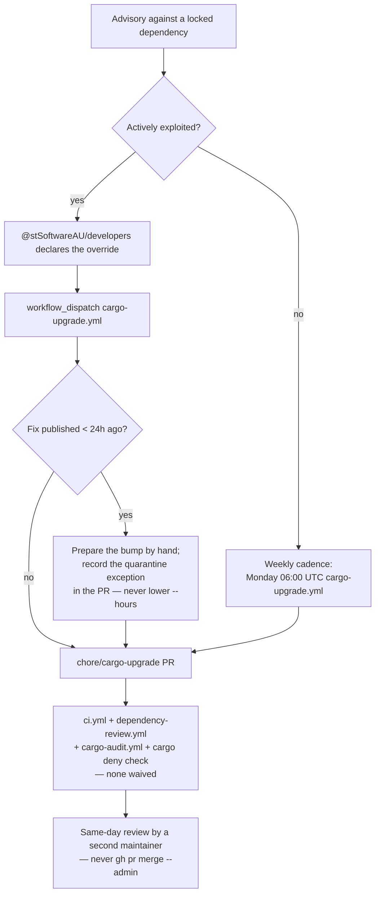

## Summary

`SECURITY.md` documented inbound vulnerability reporting and internal
escalation for a red security job, but nothing about *leaving* the routine
dependency cadence. That cadence is deliberately slow — `cargo-audit.yml` and
`cargo-upgrade.yml` both wake at 06:00 UTC on a Monday, and
`scripts/crates-quarantine.sh` refuses any crates.io version younger than 24
hours — which is right for a routine week and wrong when a CVE against a locked
dependency is being exploited today. With no written fast lane, a maintainer
facing that case improvises one under pressure, and the improvisation that
suggests itself is an administrator merge past the required checks.

This adds an **Emergency override** section to `SECURITY.md` covering the four
steps: dispatch `cargo-upgrade.yml` with `workflow_dispatch` (or prepare the
branch by hand for a transitive dependency), take the publish-age quarantine
exception on that single bump rather than by lowering `--hours` in the
workflow, fast-track the *human* review while `ci.yml`,
`dependency-review.yml`, `cargo-audit.yml` and `cargo deny check` all still
have to be green, and what to do when no fixed version exists yet.
`CONTRIBUTING.md`'s dependency-cadence section — where a maintainer meets the
weekly slot and the 24-hour window — now points at it.

Scoped to the documented override path only. The quarantine *window* itself is
issue #91 and is unchanged here.

Closes #95.

## Evidence

Documentation change with no web interface to screenshot. The evidence is the
gate: `rebase/tests/emergency_override.rs` reads the committed `SECURITY.md`
and `CONTRIBUTING.md` and fails when the procedure is absent or incomplete, so
the section cannot be quietly deleted or hollowed out later. It follows the
convention `rebase/tests/security_alerting.rs` and
`rebase/tests/dependabot_config.rs` already set for policy-in-the-tree gates.

Observed red before the docs were written (5 of 7 failing, the two parser tests
passing):

```text
---- the_policy_documents_how_to_raise_a_bump_outside_the_weekly_cadence stdout ----
SECURITY.md must document an emergency-override path for an actively-exploited
advisory — a maintainer improvising one under pressure reaches for an
administrator merge. Found headings ["Reporting a vulnerability", "Internal
escalation — a security job that goes red", "Scope", "Supported versions"]

test result: FAILED. 2 passed; 5 failed
```

Green after:

```text
running 7 tests
test a_sub_heading_stays_inside_the_section_it_belongs_to ... ok
test a_policy_with_no_override_section_is_rejected ... ok
test the_policy_names_who_approves_an_out_of_cadence_bump ... ok
test the_policy_says_what_the_publish_age_quarantine_does_to_a_same_day_fix ... ok
test the_policy_states_which_gates_the_fast_lane_may_never_skip ... ok
test the_policy_documents_how_to_raise_a_bump_outside_the_weekly_cadence ... ok
test the_contributing_guide_points_at_the_documented_override ... ok

test result: ok. 7 passed; 0 failed
```

`./quality.sh` passes in full, and `npx markdownlint-cli2@0.23.2` reports
`0 issues in 0 files` — the same command `.github/workflows/markdown-lint.yml`
runs.

The documented path, and where it rejoins the routine one:



## Test Plan

Added `rebase/tests/emergency_override.rs` — seven tests over the committed
policy documents:

* `the_policy_documents_how_to_raise_a_bump_outside_the_weekly_cadence` — the
  override section names `cargo-upgrade.yml` and the `workflow_dispatch`
  trigger that starts it out of cadence.
* `the_policy_says_what_the_publish_age_quarantine_does_to_a_same_day_fix` — it
  names `scripts/crates-quarantine.sh` and the 24-hour window the fix will hit.
* `the_policy_names_who_approves_an_out_of_cadence_bump` — it names
  `@stSoftwareAU/developers`, so the override is not one anyone may take alone.
* `the_policy_states_which_gates_the_fast_lane_may_never_skip` — it names
  `ci.yml`, `dependency-review.yml` and `cargo-audit.yml`, and refuses
  `--admin` by name.
* `the_contributing_guide_points_at_the_documented_override` — the cadence
  guide cites `SECURITY.md` *and* names the emergency path, so the two do not
  drift apart.
* `a_policy_with_no_override_section_is_rejected` — drives the section parser
  with a synthetic reporting-only policy: two sections found, a section keeps
  its own prose, stops at the next `## `, and no override section is reported.
  This is the shape the suite exists to catch, so the helper must not pass it.
* `a_sub_heading_stays_inside_the_section_it_belongs_to` — a procedure written
  as `### ` sub-steps is read as one override section, not several.

No existing tests were modified or removed.
