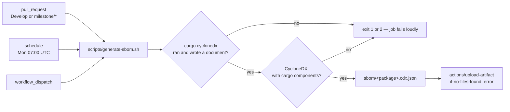

# Publish a CycloneDX SBOM for the crate

## Summary

`rebase/Cargo.toml` builds a binary crate in a public repository, and nothing in
the tree said what that binary is built from: no SBOM was committed, and no
workflow generated or uploaded one. A downstream consumer had to resolve the
dependency graph by hand from `Cargo.lock`.

This adds the generation path and publishes what it produces:

* **`scripts/generate-sbom.sh`** drives `cargo cyclonedx` — which reads
  `Cargo.lock` *and* `cargo metadata`, so the SBOM reflects the feature set
  actually resolved — then checks what came back really is a CycloneDX document
  naming cargo components before collecting it into one output directory as
  `sbom/<package-directory>.cdx.json`. A generator that writes nothing, writes
  something that is not CycloneDX, writes a bill of materials naming no
  dependency, or dies is a failure with its own exit code (1 for an unusable or
  absent SBOM, 2 for a fault) — an absent artefact is never reported as a clean
  one.
* **`.github/workflows/sbom.yml`** runs that same script on every pull request
  (`Develop` and `milestone/*`) and at 07:00 UTC every Monday, then uploads the
  result with `actions/upload-artifact` as `sbom-<sha>`, with
  `if-no-files-found: error` so an upload with nothing to upload fails the job.
  Third-party actions are pinned to 40-character commit SHAs and
  `contents: read` is the whole permission set, matching `ci.yml`,
  `cargo-audit.yml` and `semgrep.yml`.

The SBOM is deliberately **not** committed: it is derived from `Cargo.lock` and
`cargo metadata`, so a checked-in copy is stale the moment a dependency moves
and a reviewer cannot tell a stale one from a current one. `/sbom/` is
gitignored and the artefact is regenerated on every PR instead.

Closes #96.

## Evidence

Backend/CI configuration change with no web interface to screenshot. The
evidence is a real end-to-end run of the committed script, the test suite,
`actionlint`, and the full local gate.

### A real run against this workspace

`cargo-cyclonedx` 0.5.9 (the version the workflow pins, prebuilt binary from the
upstream release, SHA-256 verified) run over the committed manifest:

```text
$ ./scripts/generate-sbom.sh
Generating CycloneDX SBOM for .../NEAT-AI-Rebase/Cargo.toml
OK   .../NEAT-AI-Rebase/sbom/rebase.cdx.json
OK   1 SBOM document(s) collected into .../NEAT-AI-Rebase/sbom
$ echo $?
0
$ grep -c 'pkg:cargo/' sbom/rebase.cdx.json
38
```

The document is 40 KB of CycloneDX 1.3 listing 38 cargo components —
`neat-ai-rebase` itself, the `neat-core` path dependency, and the full
transitive graph behind `clap`, `serde`, `serde_json` and `sha2`. The generated
directory was removed again before committing; nothing derived is in the tree.

### What is published, and when



### Fail-loud paths, exercised

Each of these was run against a stub generator in `rebase/tests/sbom_gate.rs`,
and the real script hit the same path when an unusable binary was tried first —
`cargo cyclonedx` exited non-zero and the script exited 2 with
`FAIL: cargo cyclonedx exited non-zero — no SBOM can be trusted from this run`,
rather than reporting an empty SBOM directory as success.

## Test Plan

`rebase/tests/sbom_gate.rs` (new, 13 checks) — every one drives the committed
script or reads the committed workflow:

* `a_healthy_generator_yields_a_collected_sbom` — the document is validated,
  collected as `sbom/rebase.cdx.json`, and not left loose in the workspace.
* `a_stale_sbom_is_not_republished_as_a_fresh_one` — a previous run's
  `*.cdx.json` is cleared before this run's is written.
* `a_generator_that_writes_nothing_fails_loudly` — exit 0 with no output is
  exit 1 here, naming what is missing.
* `a_document_that_is_not_cyclonedx_is_rejected`,
  `a_document_listing_no_cargo_components_is_rejected` — exit 1, and nothing
  reaches the artefact directory.
* `a_failing_generator_is_a_fault_not_a_pass`, `a_missing_generator_is_a_fault`,
  `a_missing_manifest_is_a_fault`, `an_unknown_argument_is_a_usage_error` —
  exit 2 for a fault, never a quiet pass.
* `the_output_directory_is_selectable` — `--output-dir` is honoured.
* `the_sbom_workflow_runs_the_gate_and_uploads_what_it_wrote`,
  `every_action_the_sbom_workflow_uses_is_pinned`,
  `the_sbom_workflow_is_scheduled_dispatchable_and_read_only` — the workflow
  runs the committed script (not an inline command that can drift), uploads via
  a SHA-pinned `actions/upload-artifact` with `if-no-files-found: error`, is
  scheduled and dispatchable, and stays `contents: read`.

`rebase/tests/workflow_branch_filters.rs` (modified) — two checks added,
`sbom_covers_milestone_pull_requests` and `sbom_still_covers_unnested_branches`,
so the new workflow's filter is held to the same `milestone/*` rule as every
other gate. The existing sweep in `rebase/tests/workflow_concurrency.rs` already
covers the new workflow's `concurrency:` block and passes.

Gate results: `./quality.sh` passes end to end (shellcheck over the new script,
`actionlint` over the new workflow, `cargo fmt --check`, clippy, the full test
suite, `cargo deny`, doc build). `markdownlint-cli2` passes over the documentation
changes.

Documentation: `CONTRIBUTING.md` gains the workflow's entry in the CI list —
what it publishes, why the SBOM is not committed, and the one command that
reproduces it locally. `SECURITY.md` records why this scheduled job needs no
failure-routing job of its own (unlike `cargo-audit.yml`): the same job runs on
every pull request, so a break goes red in front of an author.
