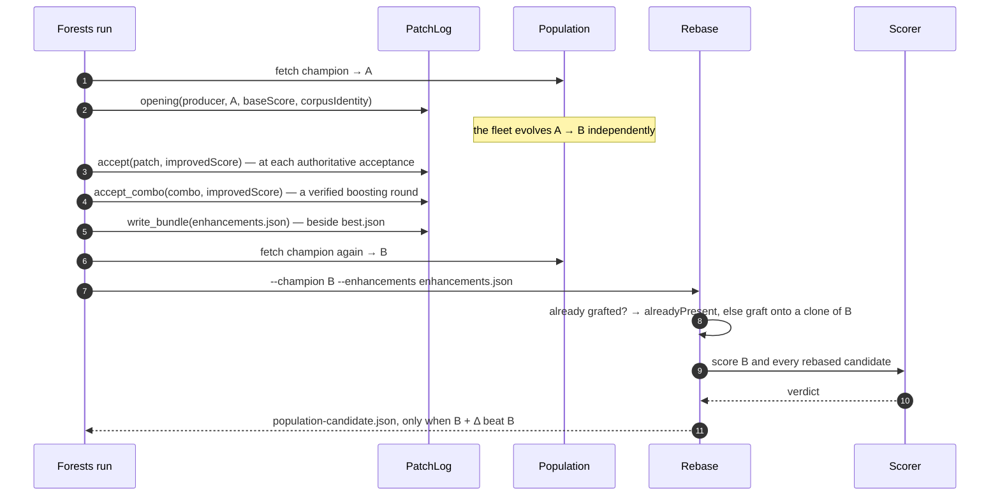
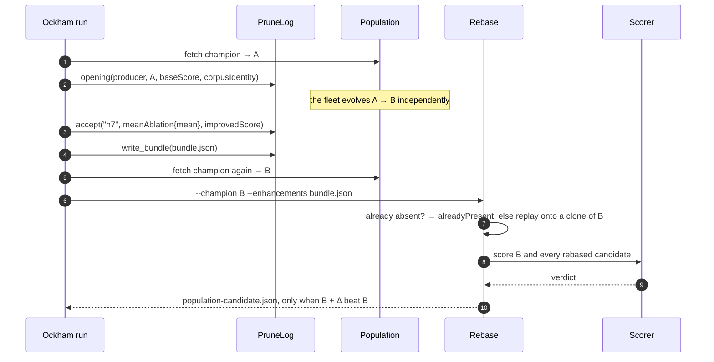

# Producer integration checklist

This is what an optimiser has to do to stop losing its discoveries — and to
stop destroying everybody else's — at population re-entry. It changes how you
*publish*, not how you *search*.

Rebase is generic infrastructure. Nothing below assumes what your creature
predicts.

## The invariant

> Your discovery behaviour must not change. This changes population re-entry
> only.

If integrating Rebase makes you want to alter what your optimiser searches for,
or how it locally accepts a candidate, stop: that is a different change and it
needs its own evidence.

## Checklist

### 1. Record the opening ancestor

At the start of the run, capture:

* the SHA-256 of the opening creature's JSON bytes → `baseChecksum`;
* its authoritative score → `baseScore`;
* the corpus identity → `corpusIdentity`;
* the creature's input and output widths → `inputCount` / `outputCount`.

These go on every enhancement the run files. In Rust they are one
`ProducerContext`.

### 2. File each accepted improvement as an enhancement

Not the resulting creature. Not `best.json`. The **exact semantic change** you
accepted, in the [v1 format](enhancement-format.md), preserved byte-for-byte —
including the payload's own provenance, which Rebase carries through to the
journal.

Do this at the moment of acceptance, in acceptance order. A run that files only
its final creature has thrown away everything Rebase needs.

Neither producer has to hand-build the envelope: `PatchLog` (Forests) and
`PruneLog` (Ockham) hold the opening facts from step 1 and stamp them on every
accepted change, so a bundle cannot end up naming a creature nobody else has.
See the worked examples below.

### 3. Refresh the champion at re-entry time

When the run ends, fetch the current global champion **again**, through
whatever mechanism you already use. Do not reuse the creature you opened on,
and do not reuse a champion you fetched earlier in the run.

### 4. Invoke Rebase

```bash
neat_ai_rebase \
  --champion "$fresh_champion" \
  --enhancements "$bundle" \
  --training-data "$corpus" \
  --scorer "$rust_scorer" \
  --output-dir "$run/rebase"
```

Or call the library directly — `rebase()` then `judge()`.

### 5. Publish only what Rebase emits

Push `population-candidate.json`, and only that file, and only when it exists.
Exit `3` means there was nothing to publish; that is a normal outcome, not a
reason to fall back to your own descendant.

### 6. Keep your old path behind a switch

Until the new path has proved itself on your workload, keep the direct
re-entry path available behind a feature switch, and log which one ran. Remove
the duplication when you have evidence, not before.

### 7. Log the four facts

Every run should make these greppable: the **opening ancestor** checksum, the
**fresh champion** checksum, the **rebase candidate** checksum, and the
**scorer verdict**. Without all four, a surprising population state cannot be
explained after the fact.

## Worked example — Forests

A Forests run opens on `A`, accepts two patches, and finishes 50 minutes later.



1. On open: same four facts, held in one `PatchLog`.

   ```rust
   let mut log = PatchLog::opening("neat-ai-forests/0.1.18", &opening, base_score, &corpus_identity)?;
   ```

2. On each accepted patch: file the patch **as accepted**, in acceptance order.

   ```rust
   log.accept(&accepted_patch, improved_score)?;
   ```

   Which produces
   `{"meta": {…}, "payload": {"kind": "forestPatch", "patch": <the exact accepted patch>}}`.
   The patch is the one Forests already writes to `experiments.jsonl` — pass
   those bytes rather than rebuilding them, so `Patch::id()` matches the id the
   graft named its structure with. A boosting round that was verified as a
   combo is filed with `accept_combo`, which appends the members the run has
   not already filed, in the order the combo applies them, so the bundle's
   prefix of that length reproduces the creature the combo's score was measured
   on. Filing fails closed on a non-finite score, an unsupported patch version,
   a non-finite weight, threshold or leaf, a bare-leaf root, an output or
   feature index `A` does not have, a condition naming one feature twice, and
   the same patch filed twice.
3. At the end: `log.write_bundle(path)?` — it returns `false` and writes
   nothing when the run accepted no patch, which is the signal not to invoke
   Rebase at all. Then fetch the champion **again**. It is now `B`, which grew
   a hidden neuron the run never saw; the run's own descendant is `A + Δ` and
   is not the fleet's champion.
4. Invoke Rebase. It grafts both patches onto clones of `B` — `B`'s new neuron
   untouched — and builds `bundle`, `single-00`, `single-01`.
5. The scorer prefers `bundle`. `population-candidate.json` is `B + Δ₁ + Δ₂`.
   `B`'s independent improvement survives, and so do both discoveries.

If `B` had already contained one of the patches — another host got there first
— that one is reported `alreadyPresent` and no duplicate structure is built.

If both patches turn out to hurt `B`, nothing is emitted and `B` remains
champion. The run still succeeded: it learned something, and it destroyed
nothing.

## Worked example — Ockham

An Ockham run opens on `A` and proves that hidden neuron `h7` is not earning
its keep. Meanwhile the fleet moves the champion on to `B`.



1. On open: same four facts, held in one `PruneLog`.

   ```rust
   let mut log = PruneLog::opening("neat-ai-ockham/0.4.2", &opening, base_score, &corpus_identity)?;
   ```

2. On acceptance: file the exact transformation, in acceptance order.

   ```rust
   log.accept("h7", RemovalStrategy::MeanAblation { mean: 0.03125 }, improved_score)?;
   ```

   Which produces
   `{"kind": "ockhamRemoval", "neuronUuid": "h7", "strategy": "meanAblation", "mean": 0.03125}`.
   The strategy matters — record the one you actually ran, because
   `identityCollapse` and `meanAblation` produce different creatures and Rebase
   will refuse rather than substitute. Filing fails closed on a non-finite
   score or mean, a UUID `A` never carried, a neuron that was not hidden, and
   the same removal filed twice.
3. At the end: `log.write_bundle(path)?` — it returns `false` and writes
   nothing when the run accepted no prune, which is the signal not to invoke
   Rebase at all. Then fetch the champion **again**. Your local incumbent is
   `A` minus your prunes; it is not the fleet's current champion, and treating
   it as one is the race.
4. Invoke Rebase with the fresh champion.
   * If `B` still has `h7`, the removal replays onto `B` and is scored.
   * If `B` has already dropped `h7` — the fleet pruned it, or another host's
     rebase did — it is reported `alreadyPresent`. No error, no retry, and no
     corpus pass.
   * If `B` has changed `h7` such that the recorded transformation cannot be
     reproduced — the squash it was collapsed as is no longer IDENTITY, say —
     the prune is reported `incompatible` with the reason, the other prunes in
     the bundle are unaffected, and `B` stands.
5. Publish only what Rebase emits.
6. Keep the run's own replay path behind a switch (step 6 above) and log which
   one ran. `rebase/tests/ockham_reentry.rs` is the evidence that the generic
   path handles the four cases; evidence on your workload is what retires the
   duplication.

## Writing a new adapter

If your optimiser's change is neither a Forest graft nor an Ockham removal, a
new payload kind needs:

* a wire form with **no application-domain assumptions** — indices and UUIDs,
  not names of things in your problem;
* an identity derived from the change alone, so two producers that find the
  same thing agree;
* a presence test that answers "does this creature already carry this?" from
  the creature itself, with no reference to who published it;
* a replay that reproduces the accepted transformation **or refuses**, never a
  near-miss substitute;
* preconditions that fail closed with a reason a human can act on;
* an output that passes `neat_core::creature_validate` and compiles.

`rebase/src/forest.rs` and `rebase/src/ockham.rs` are the two worked examples.
Both are about 400 lines including their tests.

Do not add a kind whose replay semantics you cannot state. Version 1 leaves out
generic weight and bias mutations for exactly that reason.

## Common mistakes

| Mistake | What happens |
| --- | --- |
| Filing `best.json` instead of the change | nothing to rebase; you are back to publishing a stale descendant |
| Reusing the opening creature as `--champion` | the race is reintroduced in full |
| Normalising or rounding the payload before filing | the id changes, and the enhancement is grafted twice |
| Treating exit `3` as a failure | healthy runs look broken |
| Falling back to your own descendant when Rebase emits nothing | the monoculture regression, restored |
| Publishing on the producer's `improvedScore` | promoting on evidence rather than on a verdict |
