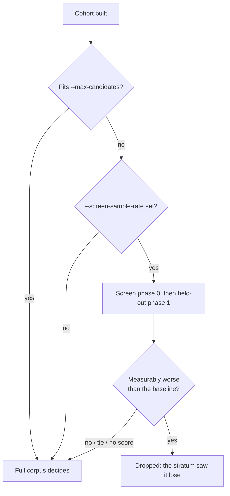

# The rebase protocol

## The problem

A long-running optimiser opens on champion **A**, spends 45–60 minutes finding
a real improvement **Δ**, and finishes. By then the fleet has evolved to
champion **B**, which contains improvements the optimiser never saw.

Publishing `A + Δ` is the obvious move and the wrong one: it silently deletes
everything that made B better than A.

```text
A ── optimiser ──▶ A + Δ          ← the stale descendant. Do not publish this.
│
└──────── fleet evolves ────────▶ B
                                  │
                                  └─ reapply Δ ─▶ B + Δ
                                                 │
                                                 └─ authoritative scorer decides
```

Repeat that across a fleet and the population converges on whichever process
happens to finish last — a **monoculture** descended from one search process,
having discarded exactly the concurrent discoveries that made running several
different optimisers worthwhile. `rebase/tests/race_conditions.rs` exists to
keep that from creeping back.

## The stages

```text
opening ancestor  ─▶  enhancement bundle  ─▶  fresh champion  ─▶  candidate cohort  ─▶  scorer verdict
      (A)                    (Δ…)                   (B)              (B, B+Δ, …)          (emit or not)
```

### 1. Opening ancestor

The producer records the checksum and authoritative score of the creature it
started from, plus the corpus identity it is measuring against. This is
provenance, not permission.

### 2. Enhancement bundle

Every locally accepted improvement is recorded as a portable
[enhancement](enhancement-format.md) — the *semantic change*, not the resulting
creature. The producer keeps its own `best.json` if it wants; Rebase does not
read it.

### 3. Fresh champion

**Fetch the current global champion again, immediately before invoking Rebase.**
Rebase loads it once and never re-reads it. Handing it a champion that is
itself an hour old just moves the race one step along.

### 4. Candidate cohort

Rebase runs the common compatibility gate, skips what is already present,
applies the rest to clones of the champion, and builds a small cohort:

| Label | What it is |
| --- | --- |
| `baseline` | the champion itself, always present, never counted against the cap |
| `bundle` | every applicable enhancement, in the producer's order |
| `single-NN` | each applicable enhancement on its own |
| `prefix-NN` | the cumulative prefixes in between |

Candidates are de-duplicated by the checksum of the resulting creature, and a
candidate identical to the champion is dropped: asking the scorer whether the
champion beats itself wastes a corpus pass.

Singles *and* combinations are built because the engine makes **no assumption
of additivity**. Two changes that each helped separately may interact badly.
Scoring both lets the scorer pick the best verified subset instead of Rebase
guessing which member carries the improvement.

### 4b. Screening, and the trap in it

Constructing a cohort is cheap; scoring it is not. A full-corpus pass over the
production corpus is minutes, so it is tempting to rank the cohort on a
sub-sample first and only pay for the promising members.

That is a good instinct with a sharp edge. **Do not select on a sample and then
judge that selection on the same sample.** With N candidates, some beat the
baseline on any given stratum by chance, and "keep the ones that won" picks
exactly those. Measured on the live fleet: choosing the best 32 of 101 patches
on a 2% stratum and re-scoring that selection on the same stratum reported
**+5.9e-04**; the full corpus scored it at **−4.3e-05**. A held-out re-screen
on a different stratum of the same size retained 16 of 29 — about what coin
flips give when the true effect is zero.

The scorer supports this directly: `--sample-phase` shifts the deterministic
stride to a different subsample of the same size. So:

1. screen on one phase;
2. re-screen the survivors on another phase, and keep the intersection;
3. **confirm on the full corpus**, which is the only step that decides
   anything.

Step 3 is what makes a verdict safe — it always was, and a candidate selected
from noise simply loses there. Steps 1 and 2 are what stop the expensive pass
being spent on noise in the first place.

Two further edges, both found on a live run (Issue #42):

**A screen that cannot save a pass must not run.** Steps 1 and 2 cost a scorer
invocation of their own and can only ever discard information. When the cohort
already fits the authoritative budget (`--max-candidates`) every member is
scored either way, so screening buys nothing and can only lose patches. Rebase
engages the screen on the *budget*, not on the enhancement count: below the cap
the cohort goes straight to step 3.

**Elimination is one-sided.** A graft is an `IF` subtree that fires on a subset
of records. If none of its firing records land in the stratum, its sampled
score equals the baseline exactly — the stratum failed to resolve it, which is
not the same as it failing. Racing methods drop an arm only once it is behind,
so step 1 drops only what the stratum can *see* losing, by more than
`--min-improvement`; a tie, a sub-resolution difference, or a missing sampled
score is **undecided** and goes to step 3. Otherwise a patch already accepted on
the full corpus against base `A` gets vetoed on base `B` by a far weaker test
than the one that admitted it.



### 5. Scorer verdict

The champion and the whole cohort are scored in **one** authoritative
full-corpus call, so every number is comparable. A candidate is emitted only
when it beats the champion by more than the configured `--min-improvement`.

A tie is not a win: replacing the champion with an equal-scoring creature costs
a population slot and buys nothing.

## Running it

```bash
neat_ai_rebase \
  --champion champion.json \
  --enhancements bundle.json \
  --training-data training/ \
  --scorer ../NEAT-AI-scorer/target/release/rust_scorer \
  --output-dir runs/rebase-1
```

| Output | Written when |
| --- | --- |
| `population-candidate.json` | **only** on a verified improvement |
| `rebase.json` | always — the full summary, verdict included |
| `experiments.jsonl` | always — append-only journal, read back by `neat_ai_rebase report <experiments.jsonl>...` |

Neither the champion file nor any enhancement file is ever written to.

| Exit code | Meaning |
| --- | --- |
| `0` | a verified improvement was emitted (with `--dry-run`: candidates built and validated) |
| `3` | no improvement, or nothing left to do — **a successful, non-destructive outcome** |
| `4` | incompatible input: nothing could be attempted |
| `1` | operational or scorer failure |

`3` is deliberately not `0` so a caller can tell "published" from "correctly
published nothing" without parsing JSON. It is not an error.

A run that reached the scorer also writes one line saying what happened,
whichever way the verdict went — to the journal's `result` record, and on a win
to the emitted creature's `rebase` tag. A run that scored nothing at all
(`nothingToDo`, `incompatible`, `dryRun`) has no scores to compare and writes no
such line:

```text
🪢 Rebase applied · 2 enhancements from neat-ai-forests · champion 0.419407 → rebased 0.419751 (+3.44e-4) · claim delta -1.50e-3 vs claimed 0.421251
🪢 Rebase not applied · 2 enhancements from neat-ai-forests · champion 0.500000 held · best candidate 0.490000 (-1.00e-2) · claim delta -1.10e-1 vs claimed 0.600000
```

`claimed` is the producer's own figure, taken on its older opening creature;
`champion` and `rebased` both come from this run's authoritative scorer. A
negative **claim delta** is two measurements disagreeing, not the creature
declining, and the wording says so — see the README for the full vocabulary
(Issue #80).

## What Rebase will not do

* It will not modify the champion, or any enhancement file.
* It will not promote a candidate on the strength of a previous success.
* It will not emit anything when the scorer failed, however it failed.
* It will not guess at an enhancement kind or version it does not implement.

See [the failure model](failure-model.md) for what each refusal means and what
is safe to retry.
